# MDL Grammar Reference

> Auto-generated from ANTLR4 grammar on 2026-01-16

This document provides a complete reference for the MDL (Mendix Definition Language) syntax.
Each grammar rule is documented with its syntax, description, and examples.

## Table of Contents

- [Statements](#statements)
  - [program](#program)
  - [statement](#statement)
  - [createEntityStatement](#createentitystatement)
  - [createMicroflowStatement](#createmicroflowstatement)
  - [createPageStatement](#createpagestatement)
- [Entity Definitions](#entity-definitions)
  - [attributeDefinition](#attributedefinition)
- [Microflow Statements](#microflow-statements)
- [Page Definitions](#page-definitions)
- [OQL Queries](#oql-queries)
  - [oqlQuery](#oqlquery)
- [Expressions](#expressions)
  - [literal](#literal)
- [Other Rules](#other-rules)
  - [dataType](#datatype)
  - [qualifiedName](#qualifiedname)
  - [docComment](#doccomment)
  - [annotation](#annotation)
  - [keyword](#keyword)

## Statements

### program

Entry point: a program is a sequence of statements

**Syntax:**

```ebnf
program
    : statement* EOF
```

**Railroad Diagram:**

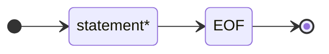

---

### statement

A statement can be DDL, DQL, or utility

**Syntax:**

```ebnf
statement
    : docComment? (ddlStatement | dqlStatement | utilityStatement) SEMICOLON? SLASH?
```

**Railroad Diagram:**

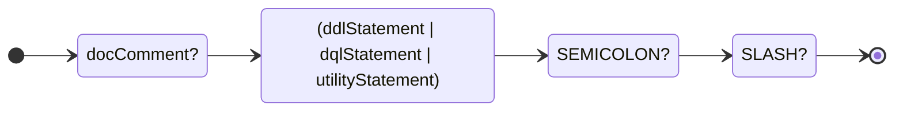

---

### ddlStatement

**Syntax:**

```ebnf
ddlStatement
    : createStatement
    | | alterStatement
    | | dropStatement
    | | renameStatement
```

**Railroad Diagram:**

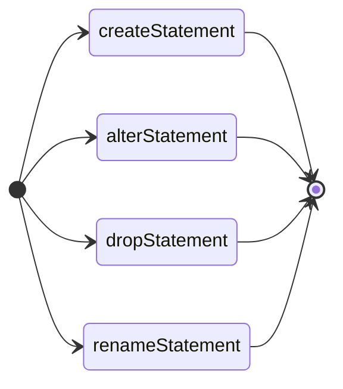

---

### createStatement

**Syntax:**

```ebnf
createStatement
    : docComment? annotation*
    | CREATE (OR (MODIFY | REPLACE))?
    | ( createEntityStatement
    | | createAssociationStatement
    | | createModuleStatement
    | | createMicroflowStatement
    | | createPageStatement
    | | createSnippetStatement
    | | createEnumerationStatement
    | | createValidationRuleStatement
    | | createNotebookStatement
    | | createDatabaseConnectionStatement
    | | createConstantStatement
    | | createRestClientStatement
    | | createIndexStatement
    | )
```

**Railroad Diagram:**

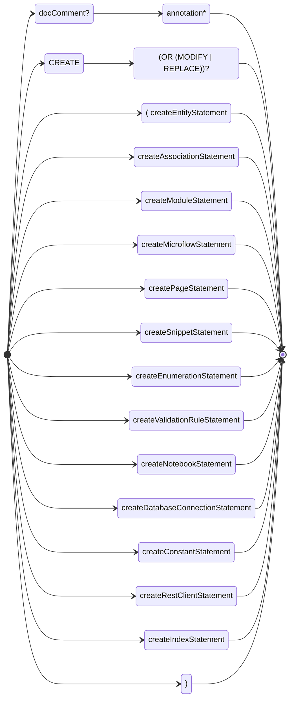

---

### alterStatement

**Syntax:**

```ebnf
alterStatement
    : ALTER ENTITY qualifiedName alterEntityAction+
    | | ALTER ASSOCIATION qualifiedName alterAssociationAction+
    | | ALTER ENUMERATION qualifiedName alterEnumerationAction+
    | | ALTER NOTEBOOK qualifiedName alterNotebookAction+
```

**Railroad Diagram:**

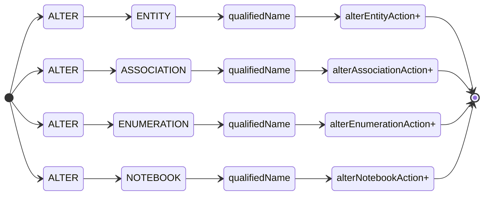

---

### dropStatement

**Syntax:**

```ebnf
dropStatement
    : DROP ENTITY qualifiedName
    | | DROP ASSOCIATION qualifiedName
    | | DROP ENUMERATION qualifiedName
    | | DROP MICROFLOW qualifiedName
    | | DROP NANOFLOW qualifiedName
    | | DROP PAGE qualifiedName
    | | DROP SNIPPET qualifiedName
    | | DROP MODULE qualifiedName
    | | DROP NOTEBOOK qualifiedName
    | | DROP INDEX qualifiedName ON qualifiedName
```

**Railroad Diagram:**

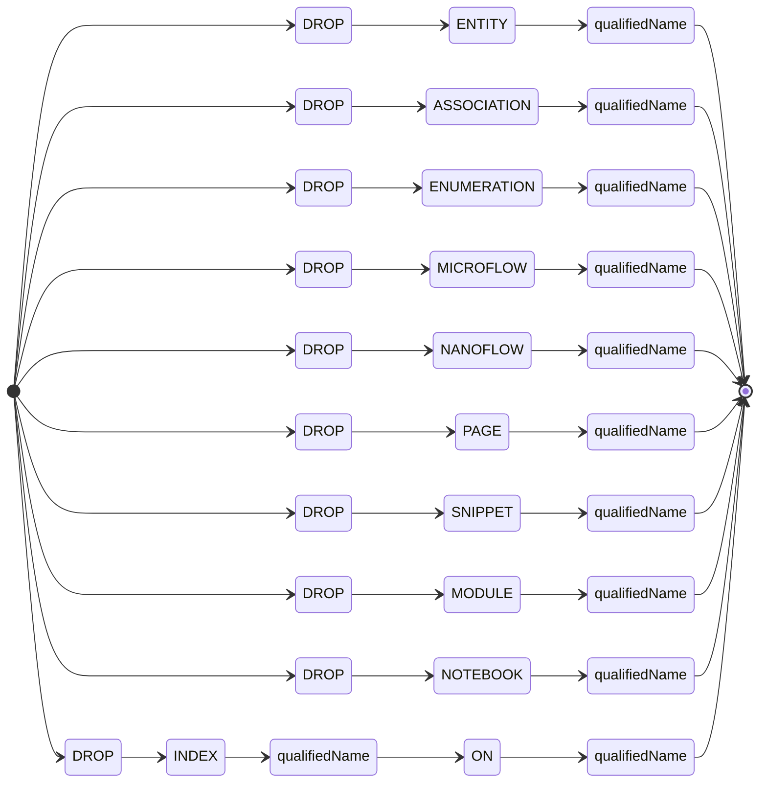

---

### renameStatement

**Syntax:**

```ebnf
renameStatement
    : RENAME ENTITY qualifiedName TO IDENTIFIER
    | | RENAME MODULE IDENTIFIER TO IDENTIFIER
```

**Railroad Diagram:**

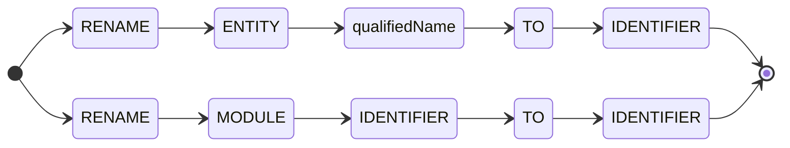

---

### createEntityStatement

Creates a new entity in the domain model.  Entities can be persistent (stored in database), non-persistent (in-memory only), view (based on OQL query), or external (from external data source).

**Syntax:**

```ebnf
createEntityStatement
    : PERSISTENT ENTITY qualifiedName entityBody?
    | | NON_PERSISTENT ENTITY qualifiedName entityBody?
    | | VIEW ENTITY qualifiedName entityBody? AS LPAREN? oqlQuery RPAREN?  // Parentheses optional
    | | EXTERNAL ENTITY qualifiedName entityBody?
    | | ENTITY qualifiedName entityBody?  // Default to persistent
```

**Railroad Diagram:**

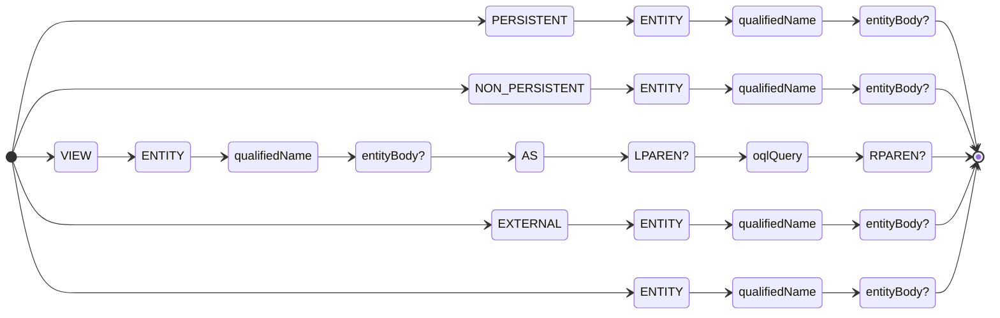

**Examples:**

*Persistent entity with attributes:*

```sql
CREATE PERSISTENT ENTITY MyModule.Customer (
  Name: String(100) NOT NULL,
  Email: String(200) UNIQUE,
  Age: Integer,
  Active: Boolean DEFAULT true
);
```

*Non-persistent entity for search filters:*

```sql
CREATE NON-PERSISTENT ENTITY MyModule.SearchFilter (
Query: String,
MaxResults: Integer DEFAULT 100,
IncludeArchived: Boolean DEFAULT false
);
```

*View entity with OQL query:*

```sql
CREATE VIEW ENTITY MyModule.ActiveCustomers (
CustomerId: Integer,
CustomerName: String(100)
) AS
SELECT c.Id AS CustomerId, c.Name AS CustomerName
FROM MyModule.Customer AS c
WHERE c.Active = true;
```

*Entity with index:*

```sql
CREATE PERSISTENT ENTITY MyModule.Order (
OrderNumber: String(50) NOT NULL,
CustomerRef: MyModule.Customer
)
INDEX (OrderNumber);
```

**See also:** [attributeDefinition for attribute syntax](#attributedefinition-for-attribute-syntax), [dataType for supported data types](#datatype-for-supported-data-types), [oqlQuery for view entity queries](#oqlquery-for-view-entity-queries)

---

### createAssociationStatement

**Syntax:**

```ebnf
createAssociationStatement
    : ASSOCIATION qualifiedName
    | FROM qualifiedName
    | TO qualifiedName
    | associationOptions?
```

**Railroad Diagram:**

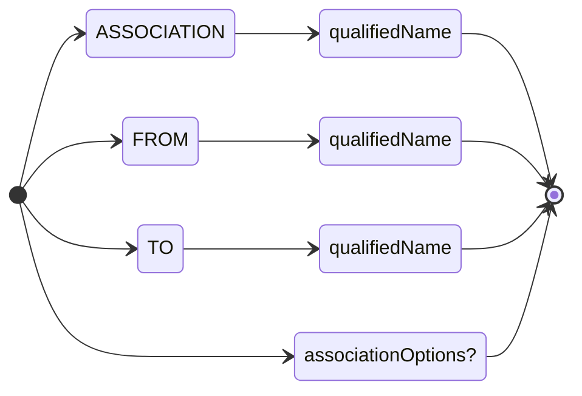

---

### createModuleStatement

**Syntax:**

```ebnf
createModuleStatement
    : MODULE IDENTIFIER moduleOptions?
```

**Railroad Diagram:**

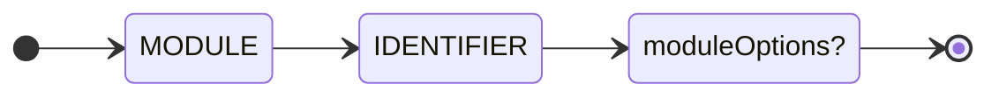

---

### createEnumerationStatement

**Syntax:**

```ebnf
createEnumerationStatement
    : ENUMERATION qualifiedName
    | LPAREN enumerationValueList RPAREN
    | enumerationOptions?
```

**Railroad Diagram:**

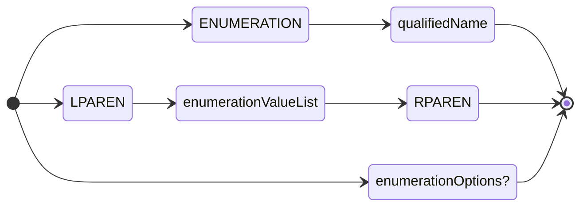

---

### createValidationRuleStatement

**Syntax:**

```ebnf
createValidationRuleStatement
    : VALIDATION RULE qualifiedName
    | FOR qualifiedName
```

**Railroad Diagram:**

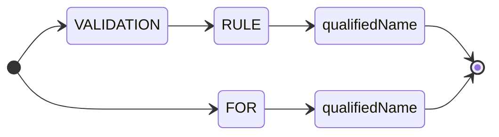

---

### createMicroflowStatement

Creates a new microflow with parameters, return type, and activity body.  Microflows are server-side logic that can include database operations, integrations, and complex business rules.

**Syntax:**

```ebnf
createMicroflowStatement
    : MICROFLOW qualifiedName
    | LPAREN microflowParameterList? RPAREN
    | microflowReturnType?
    | microflowOptions?
    | BEGIN microflowBody END SEMICOLON? SLASH?
```

**Railroad Diagram:**

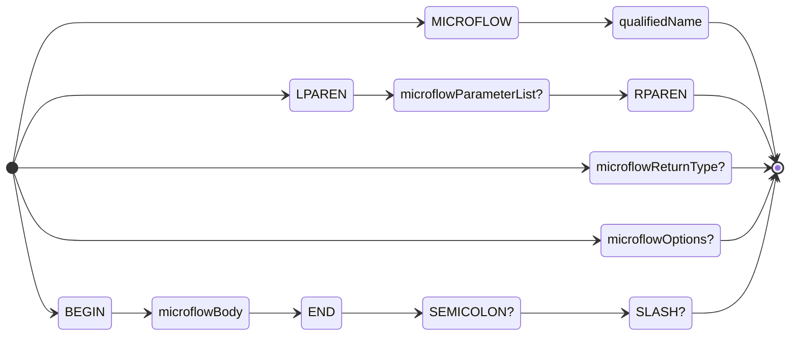

**Examples:**

*Simple microflow returning a string:*

```sql
CREATE MICROFLOW MyModule.GetGreeting ($Name: String) RETURNS String
BEGIN
RETURN 'Hello, ' + $Name + '!';
END;
```

*Microflow with entity parameter and database operations:*

```sql
CREATE MICROFLOW MyModule.DeactivateCustomer ($Customer: MyModule.Customer) RETURNS Boolean
BEGIN
$Customer.Active = false;
COMMIT $Customer;
RETURN true;
END;
```

*Microflow with RETRIEVE and iteration:*

```sql
CREATE MICROFLOW MyModule.CountActiveOrders () RETURNS Integer
BEGIN
DECLARE $Orders List of MyModule.Order;
$Orders = RETRIEVE MyModule.Order WHERE Active = true;
RETURN length($Orders);
END;
```

*Microflow calling another microflow:*

```sql
CREATE MICROFLOW MyModule.ProcessOrder ($Order: MyModule.Order) RETURNS Boolean
BEGIN
$Result = CALL MICROFLOW MyModule.ValidateOrder (Order = $Order);
IF $Result THEN
COMMIT $Order;
RETURN true;
END IF;
RETURN false;
END;
```

**See also:** [microflowBody for available activities](#microflowbody-for-available-activities), [microflowParameter for parameter syntax](#microflowparameter-for-parameter-syntax)

---

### microflowStatement

**Syntax:**

```ebnf
microflowStatement
    : declareStatement SEMICOLON?
    | | setStatement SEMICOLON?
    | | createObjectStatement SEMICOLON?
    | | changeObjectStatement SEMICOLON?
    | | commitStatement SEMICOLON?
    | | deleteObjectStatement SEMICOLON?
    | | retrieveStatement SEMICOLON?
    | | ifStatement SEMICOLON?
    | | loopStatement SEMICOLON?
    | | whileStatement SEMICOLON?
    | | continueStatement SEMICOLON?
    | | breakStatement SEMICOLON?
    | | returnStatement SEMICOLON?
    | | logStatement SEMICOLON?
    | | callMicroflowStatement SEMICOLON?
    | | callJavaActionStatement SEMICOLON?
    | | showPageStatement SEMICOLON?
    | | closePageStatement SEMICOLON?
    | | throwStatement SEMICOLON?
```

**Railroad Diagram:**

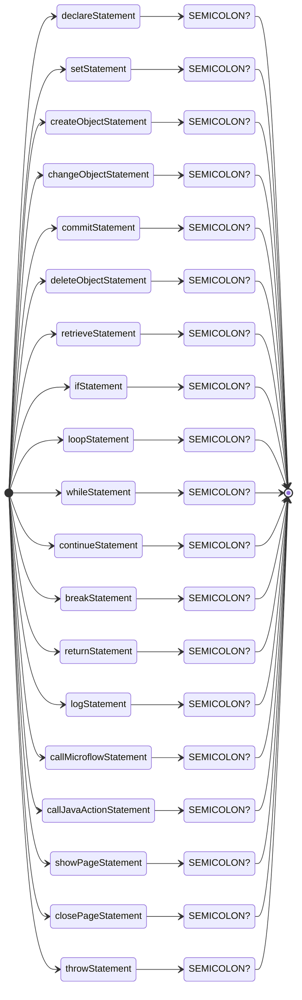

---

### declareStatement

**Syntax:**

```ebnf
declareStatement
    : DECLARE VARIABLE dataType (EQUALS expression)?
```

**Railroad Diagram:**

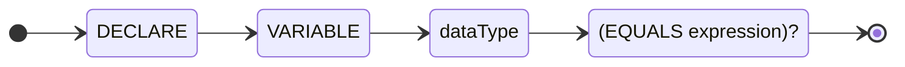

---

### setStatement

**Syntax:**

```ebnf
setStatement
    : SET (VARIABLE | attributePath) EQUALS expression
```

**Railroad Diagram:**

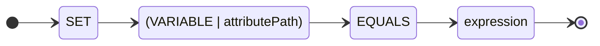

---

### createObjectStatement

**Syntax:**

```ebnf
createObjectStatement
    : CREATE VARIABLE AS dataType (SET memberAssignmentList)?
```

**Railroad Diagram:**

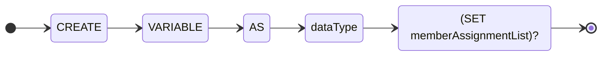

---

### changeObjectStatement

**Syntax:**

```ebnf
changeObjectStatement
    : CHANGE VARIABLE SET memberAssignmentList
```

**Railroad Diagram:**

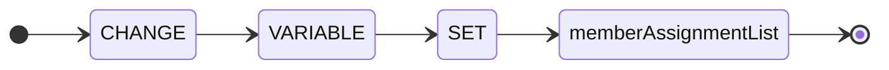

---

### commitStatement

**Syntax:**

```ebnf
commitStatement
    : COMMIT VARIABLE (WITH EVENTS)? REFRESH?
```

**Railroad Diagram:**

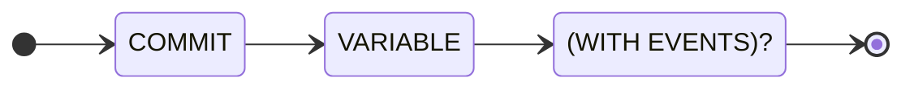

---

### deleteObjectStatement

**Syntax:**

```ebnf
deleteObjectStatement
    : DELETE VARIABLE
```

**Railroad Diagram:**

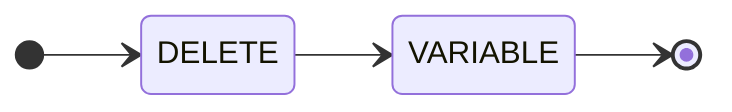

---

### retrieveStatement

**Syntax:**

```ebnf
retrieveStatement
    : RETRIEVE VARIABLE FROM retrieveSource
    | (WHERE expression)?
    | (OFFSET NUMBER_LITERAL)?
    | (LIMIT NUMBER_LITERAL)?
```

**Railroad Diagram:**

```mermaid
stateDiagram-v2
    direction LR
    state "RETRIEVE" as s1
    [*] --> s1
    state "VARIABLE" as s2
    s1 --> s2
    state "FROM" as s3
    s2 --> s3
    state "retrieveSource" as s4
    s3 --> s4
    s4 --> [*]
    state "(WHERE expression)?" as s5
    [*] --> s5
    s5 --> [*]
    state "(OFFSET NUMBER_LITERAL)?" as s6
    [*] --> s6
    s6 --> [*]
    state "(LIMIT NUMBER_LITERAL)?" as s7
    [*] --> s7
    s7 --> [*]
```

---

### ifStatement

**Syntax:**

```ebnf
ifStatement
    : IF expression THEN microflowBody
    | (ELSIF expression THEN microflowBody)*
    | (ELSE microflowBody)?
    | END IF
```

**Railroad Diagram:**

```mermaid
stateDiagram-v2
    direction LR
    state "IF" as s1
    [*] --> s1
    state "expression" as s2
    s1 --> s2
    state "THEN" as s3
    s2 --> s3
    state "microflowBody" as s4
    s3 --> s4
    s4 --> [*]
    state "(ELSIF expression THEN microflowBody)*" as s5
    [*] --> s5
    s5 --> [*]
    state "(ELSE microflowBody)?" as s6
    [*] --> s6
    s6 --> [*]
    state "END" as s7
    [*] --> s7
    state "IF" as s8
    s7 --> s8
    s8 --> [*]
```

---

### loopStatement

**Syntax:**

```ebnf
loopStatement
    : LOOP VARIABLE IN (VARIABLE | attributePath)
    | BEGIN microflowBody END LOOP
```

**Railroad Diagram:**

```mermaid
stateDiagram-v2
    direction LR
    state "LOOP" as s1
    [*] --> s1
    state "VARIABLE" as s2
    s1 --> s2
    state "IN" as s3
    s2 --> s3
    state "(VARIABLE | attributePath)" as s4
    s3 --> s4
    s4 --> [*]
    state "BEGIN" as s5
    [*] --> s5
    state "microflowBody" as s6
    s5 --> s6
    state "END" as s7
    s6 --> s7
    state "LOOP" as s8
    s7 --> s8
    s8 --> [*]
```

---

### whileStatement

**Syntax:**

```ebnf
whileStatement
    : WHILE expression
    | BEGIN? microflowBody END WHILE?
```

**Railroad Diagram:**

```mermaid
stateDiagram-v2
    direction LR
    state "WHILE" as s1
    [*] --> s1
    state "expression" as s2
    s1 --> s2
    s2 --> [*]
    state "BEGIN?" as s3
    [*] --> s3
    state "microflowBody" as s4
    s3 --> s4
    state "END" as s5
    s4 --> s5
    state "WHILE?" as s6
    s5 --> s6
    s6 --> [*]
```

---

### continueStatement

**Syntax:**

```ebnf
continueStatement
    : CONTINUE
```

**Railroad Diagram:**

```mermaid
stateDiagram-v2
    direction LR
    state "CONTINUE" as s1
    [*] --> s1
    s1 --> [*]
```

---

### breakStatement

**Syntax:**

```ebnf
breakStatement
    : BREAK
```

**Railroad Diagram:**

```mermaid
stateDiagram-v2
    direction LR
    state "BREAK" as s1
    [*] --> s1
    s1 --> [*]
```

---

### returnStatement

**Syntax:**

```ebnf
returnStatement
    : RETURN expression?
```

**Railroad Diagram:**

```mermaid
stateDiagram-v2
    direction LR
    state "RETURN" as s1
    [*] --> s1
    state "expression?" as s2
    s1 --> s2
    s2 --> [*]
```

---

### logStatement

**Syntax:**

```ebnf
logStatement
    : LOG logLevel? (NODE STRING_LITERAL)? expression logTemplateParams?
```

**Railroad Diagram:**

```mermaid
stateDiagram-v2
    direction LR
    state "LOG" as s1
    [*] --> s1
    state "logLevel?" as s2
    s1 --> s2
    state "(NODE STRING_LITERAL)?" as s3
    s2 --> s3
    state "expression" as s4
    s3 --> s4
    state "logTemplateParams?" as s5
    s4 --> s5
    s5 --> [*]
```

---

### callMicroflowStatement

**Syntax:**

```ebnf
callMicroflowStatement
    : (VARIABLE EQUALS)? CALL MICROFLOW qualifiedName LPAREN callArgumentList? RPAREN
```

**Railroad Diagram:**

```mermaid
stateDiagram-v2
    direction LR
    state "(VARIABLE EQUALS)?" as s1
    [*] --> s1
    state "CALL" as s2
    s1 --> s2
    state "MICROFLOW" as s3
    s2 --> s3
    state "qualifiedName" as s4
    s3 --> s4
    state "LPAREN" as s5
    s4 --> s5
    state "callArgumentList?" as s6
    s5 --> s6
    state "RPAREN" as s7
    s6 --> s7
    s7 --> [*]
```

---

### callJavaActionStatement

**Syntax:**

```ebnf
callJavaActionStatement
    : (VARIABLE EQUALS)? CALL JAVA ACTION qualifiedName LPAREN callArgumentList? RPAREN
```

**Railroad Diagram:**

```mermaid
stateDiagram-v2
    direction LR
    state "(VARIABLE EQUALS)?" as s1
    [*] --> s1
    state "CALL" as s2
    s1 --> s2
    state "JAVA" as s3
    s2 --> s3
    state "ACTION" as s4
    s3 --> s4
    state "qualifiedName" as s5
    s4 --> s5
    state "LPAREN" as s6
    s5 --> s6
    state "callArgumentList?" as s7
    s6 --> s7
    state "RPAREN" as s8
    s7 --> s8
    s8 --> [*]
```

---

### showPageStatement

**Syntax:**

```ebnf
showPageStatement
    : SHOW PAGE qualifiedName (LPAREN showPageArgList? RPAREN)? (FOR VARIABLE)? (WITH memberAssignmentList)?
```

**Railroad Diagram:**

```mermaid
stateDiagram-v2
    direction LR
    state "SHOW" as s1
    [*] --> s1
    state "PAGE" as s2
    s1 --> s2
    state "qualifiedName" as s3
    s2 --> s3
    state "(LPAREN showPageArgList? RPAREN)?" as s4
    s3 --> s4
    state "(FOR VARIABLE)?" as s5
    s4 --> s5
    state "(WITH memberAssignmentList)?" as s6
    s5 --> s6
    s6 --> [*]
```

---

### closePageStatement

**Syntax:**

```ebnf
closePageStatement
    : CLOSE PAGE
```

**Railroad Diagram:**

```mermaid
stateDiagram-v2
    direction LR
    state "CLOSE" as s1
    [*] --> s1
    state "PAGE" as s2
    s1 --> s2
    s2 --> [*]
```

---

### throwStatement

**Syntax:**

```ebnf
throwStatement
    : THROW expression
```

**Railroad Diagram:**

```mermaid
stateDiagram-v2
    direction LR
    state "THROW" as s1
    [*] --> s1
    state "expression" as s2
    s1 --> s2
    s2 --> [*]
```

---

### createPageStatement

Creates a new page with layout, parameters, and widget content.  Pages define the user interface with widgets arranged in a layout structure.

**Syntax:**

```ebnf
createPageStatement
    : PAGE qualifiedName
    | ( LPAREN pageParameterList? RPAREN    // Parenthesized params: PAGE Name($p: Type)
    | | pageParameterList                   // Inline params: PAGE Name\n$p: Type
    | )?
```

**Railroad Diagram:**

```mermaid
stateDiagram-v2
    direction LR
    state "PAGE" as s1
    [*] --> s1
    state "qualifiedName" as s2
    s1 --> s2
    s2 --> [*]
    state "( LPAREN pageParameterList? RPAREN" as s3
    [*] --> s3
    s3 --> [*]
    state "pageParameterList" as s4
    [*] --> s4
    s4 --> [*]
    state ")?" as s5
    [*] --> s5
    s5 --> [*]
```

**Examples:**

*Simple page with text:*

```sql
CREATE PAGE MyModule.HomePage ()
TITLE 'Welcome'
LAYOUT Atlas_Core.Atlas_Default
BEGIN
LAYOUTGRID BEGIN
ROW BEGIN
COLUMN 12 BEGIN
DYNAMICTEXT (CONTENT 'Hello, World!', RENDERMODE 'H1')
END
END
END
END;
```

*Page with parameter and data view:*

```sql
CREATE PAGE MyModule.CustomerDetails ($Customer: MyModule.Customer)
TITLE 'Customer Details'
LAYOUT Atlas_Core.Atlas_Default
BEGIN
DATAVIEW dvCustomer DATASOURCE $Customer BEGIN
TEXTBOX (ATTRIBUTE Name, LABEL 'Name'),
TEXTBOX (ATTRIBUTE Email, LABEL 'Email')
END
END;
```

*Page with action button:*

```sql
CREATE PAGE MyModule.OrderForm ($Order: MyModule.Order)
TITLE 'New Order'
LAYOUT Atlas_Core.Atlas_Default
BEGIN
ACTIONBUTTON btnSave 'Save Order'
ACTION CALL MICROFLOW MyModule.SaveOrder
STYLE Primary
END;
```

**See also:** [pageBody for widget definitions](#pagebody-for-widget-definitions), [widgetDefinition for available widgets](#widgetdefinition-for-available-widgets)

---

### createSnippetStatement

**Syntax:**

```ebnf
createSnippetStatement
    : SNIPPET qualifiedName
    | ( LPAREN snippetParameterList? RPAREN    // Parenthesized params: SNIPPET Name($p: Type)
    | | snippetParameterList                   // Inline params: SNIPPET Name\n$p: Type
    | )?
    | snippetOptions?
    | BEGIN (pageWidget SEMICOLON?)* END
```

**Railroad Diagram:**

```mermaid
stateDiagram-v2
    direction LR
    state "SNIPPET" as s1
    [*] --> s1
    state "qualifiedName" as s2
    s1 --> s2
    s2 --> [*]
    state "( LPAREN snippetParameterList? RPAREN" as s3
    [*] --> s3
    s3 --> [*]
    state "snippetParameterList" as s4
    [*] --> s4
    s4 --> [*]
    state ")?" as s5
    [*] --> s5
    s5 --> [*]
    state "snippetOptions?" as s6
    [*] --> s6
    s6 --> [*]
    state "BEGIN" as s7
    [*] --> s7
    state "(pageWidget SEMICOLON?)*" as s8
    s7 --> s8
    state "END" as s9
    s8 --> s9
    s9 --> [*]
```

---

### createNotebookStatement

**Syntax:**

```ebnf
createNotebookStatement
    : NOTEBOOK qualifiedName
    | notebookOptions?
    | BEGIN notebookPage* END
```

**Railroad Diagram:**

```mermaid
stateDiagram-v2
    direction LR
    state "NOTEBOOK" as s1
    [*] --> s1
    state "qualifiedName" as s2
    s1 --> s2
    s2 --> [*]
    state "notebookOptions?" as s3
    [*] --> s3
    s3 --> [*]
    state "BEGIN" as s4
    [*] --> s4
    state "notebookPage*" as s5
    s4 --> s5
    state "END" as s6
    s5 --> s6
    s6 --> [*]
```

---

### createDatabaseConnectionStatement

**Syntax:**

```ebnf
createDatabaseConnectionStatement
    : DATABASE CONNECTION IDENTIFIER
```

**Railroad Diagram:**

```mermaid
stateDiagram-v2
    direction LR
    state "DATABASE" as s1
    [*] --> s1
    state "CONNECTION" as s2
    s1 --> s2
    state "IDENTIFIER" as s3
    s2 --> s3
    s3 --> [*]
```

---

### createConstantStatement

**Syntax:**

```ebnf
createConstantStatement
    : CONSTANT qualifiedName
    | TYPE dataType
    | DEFAULT literal
    | constantOptions?
```

**Railroad Diagram:**

```mermaid
stateDiagram-v2
    direction LR
    state "CONSTANT" as s1
    [*] --> s1
    state "qualifiedName" as s2
    s1 --> s2
    s2 --> [*]
    state "TYPE" as s3
    [*] --> s3
    state "dataType" as s4
    s3 --> s4
    s4 --> [*]
    state "DEFAULT" as s5
    [*] --> s5
    state "literal" as s6
    s5 --> s6
    s6 --> [*]
    state "constantOptions?" as s7
    [*] --> s7
    s7 --> [*]
```

---

### createRestClientStatement

**Syntax:**

```ebnf
createRestClientStatement
    : REST CLIENT qualifiedName
```

**Railroad Diagram:**

```mermaid
stateDiagram-v2
    direction LR
    state "REST" as s1
    [*] --> s1
    state "CLIENT" as s2
    s1 --> s2
    state "qualifiedName" as s3
    s2 --> s3
    s3 --> [*]
```

---

### createIndexStatement

**Syntax:**

```ebnf
createIndexStatement
    : INDEX IDENTIFIER ON qualifiedName LPAREN indexAttributeList RPAREN
```

**Railroad Diagram:**

```mermaid
stateDiagram-v2
    direction LR
    state "INDEX" as s1
    [*] --> s1
    state "IDENTIFIER" as s2
    s1 --> s2
    state "ON" as s3
    s2 --> s3
    state "qualifiedName" as s4
    s3 --> s4
    state "LPAREN" as s5
    s4 --> s5
    state "indexAttributeList" as s6
    s5 --> s6
    state "RPAREN" as s7
    s6 --> s7
    s7 --> [*]
```

---

### dqlStatement

**Syntax:**

```ebnf
dqlStatement
    : showStatement
    | | describeStatement
    | | catalogSelectQuery
    | | oqlQuery
```

**Railroad Diagram:**

```mermaid
stateDiagram-v2
    direction LR
    state "showStatement" as s1
    [*] --> s1
    s1 --> [*]
    state "describeStatement" as s2
    [*] --> s2
    s2 --> [*]
    state "catalogSelectQuery" as s3
    [*] --> s3
    s3 --> [*]
    state "oqlQuery" as s4
    [*] --> s4
    s4 --> [*]
```

---

### showStatement

**Syntax:**

```ebnf
showStatement
    : SHOW MODULES
    | | SHOW ENTITIES (IN (qualifiedName | IDENTIFIER))?
    | | SHOW ASSOCIATIONS (IN (qualifiedName | IDENTIFIER))?
    | | SHOW MICROFLOWS (IN (qualifiedName | IDENTIFIER))?
    | | SHOW PAGES (IN (qualifiedName | IDENTIFIER))?
    | | SHOW SNIPPETS (IN (qualifiedName | IDENTIFIER))?
    | | SHOW ENUMERATIONS (IN (qualifiedName | IDENTIFIER))?
    | | SHOW CONSTANTS (IN (qualifiedName | IDENTIFIER))?
    | | SHOW LAYOUTS (IN (qualifiedName | IDENTIFIER))?
    | | SHOW NOTEBOOKS (IN (qualifiedName | IDENTIFIER))?
    | | SHOW JAVA ACTIONS (IN (qualifiedName | IDENTIFIER))?
    | | SHOW ENTITY qualifiedName
    | | SHOW ASSOCIATION qualifiedName
    | | SHOW PAGE qualifiedName
    | | SHOW CONNECTIONS
    | | SHOW STATUS
    | | SHOW VERSION
    | | SHOW CATALOG IDENTIFIER  // SHOW CATALOG TABLES, etc.
```

**Railroad Diagram:**

```mermaid
stateDiagram-v2
    direction LR
    state "SHOW" as s1
    [*] --> s1
    state "MODULES" as s2
    s1 --> s2
    s2 --> [*]
    state "SHOW" as s3
    [*] --> s3
    state "ENTITIES" as s4
    s3 --> s4
    state "(IN (qualifiedName | IDENTIFIER))?" as s5
    s4 --> s5
    s5 --> [*]
    state "SHOW" as s6
    [*] --> s6
    state "ASSOCIATIONS" as s7
    s6 --> s7
    state "(IN (qualifiedName | IDENTIFIER))?" as s8
    s7 --> s8
    s8 --> [*]
    state "SHOW" as s9
    [*] --> s9
    state "MICROFLOWS" as s10
    s9 --> s10
    state "(IN (qualifiedName | IDENTIFIER))?" as s11
    s10 --> s11
    s11 --> [*]
    state "SHOW" as s12
    [*] --> s12
    state "PAGES" as s13
    s12 --> s13
    state "(IN (qualifiedName | IDENTIFIER))?" as s14
    s13 --> s14
    s14 --> [*]
    state "SHOW" as s15
    [*] --> s15
    state "SNIPPETS" as s16
    s15 --> s16
    state "(IN (qualifiedName | IDENTIFIER))?" as s17
    s16 --> s17
    s17 --> [*]
    state "SHOW" as s18
    [*] --> s18
    state "ENUMERATIONS" as s19
    s18 --> s19
    state "(IN (qualifiedName | IDENTIFIER))?" as s20
    s19 --> s20
    s20 --> [*]
    state "SHOW" as s21
    [*] --> s21
    state "CONSTANTS" as s22
    s21 --> s22
    state "(IN (qualifiedName | IDENTIFIER))?" as s23
    s22 --> s23
    s23 --> [*]
    state "SHOW" as s24
    [*] --> s24
    state "LAYOUTS" as s25
    s24 --> s25
    state "(IN (qualifiedName | IDENTIFIER))?" as s26
    s25 --> s26
    s26 --> [*]
    state "SHOW" as s27
    [*] --> s27
    state "NOTEBOOKS" as s28
    s27 --> s28
    state "(IN (qualifiedName | IDENTIFIER))?" as s29
    s28 --> s29
    s29 --> [*]
    state "SHOW" as s30
    [*] --> s30
    state "JAVA" as s31
    s30 --> s31
    state "ACTIONS" as s32
    s31 --> s32
    state "(IN (qualifiedName | IDENTIFIER))?" as s33
    s32 --> s33
    s33 --> [*]
    state "SHOW" as s34
    [*] --> s34
    state "ENTITY" as s35
    s34 --> s35
    state "qualifiedName" as s36
    s35 --> s36
    s36 --> [*]
    state "SHOW" as s37
    [*] --> s37
    state "ASSOCIATION" as s38
    s37 --> s38
    state "qualifiedName" as s39
    s38 --> s39
    s39 --> [*]
    state "SHOW" as s40
    [*] --> s40
    state "PAGE" as s41
    s40 --> s41
    state "qualifiedName" as s42
    s41 --> s42
    s42 --> [*]
    state "SHOW" as s43
    [*] --> s43
    state "CONNECTIONS" as s44
    s43 --> s44
    s44 --> [*]
    state "SHOW" as s45
    [*] --> s45
    state "STATUS" as s46
    s45 --> s46
    s46 --> [*]
    state "SHOW" as s47
    [*] --> s47
    state "VERSION" as s48
    s47 --> s48
    s48 --> [*]
    state "SHOW" as s49
    [*] --> s49
    state "CATALOG" as s50
    s49 --> s50
    state "IDENTIFIER" as s51
    s50 --> s51
    s51 --> [*]
```

---

### describeStatement

**Syntax:**

```ebnf
describeStatement
    : DESCRIBE ENTITY qualifiedName
    | | DESCRIBE ASSOCIATION qualifiedName
    | | DESCRIBE MICROFLOW qualifiedName
    | | DESCRIBE NANOFLOW qualifiedName
    | | DESCRIBE PAGE qualifiedName
    | | DESCRIBE SNIPPET qualifiedName
    | | DESCRIBE ENUMERATION qualifiedName
    | | DESCRIBE MODULE IDENTIFIER (WITH ALL)?  // DESCRIBE MODULE Name [WITH ALL] - optionally include all objects
    | | DESCRIBE CATALOG DOT IDENTIFIER  // DESCRIBE CATALOG.ENTITIES
```

**Railroad Diagram:**

```mermaid
stateDiagram-v2
    direction LR
    state "DESCRIBE" as s1
    [*] --> s1
    state "ENTITY" as s2
    s1 --> s2
    state "qualifiedName" as s3
    s2 --> s3
    s3 --> [*]
    state "DESCRIBE" as s4
    [*] --> s4
    state "ASSOCIATION" as s5
    s4 --> s5
    state "qualifiedName" as s6
    s5 --> s6
    s6 --> [*]
    state "DESCRIBE" as s7
    [*] --> s7
    state "MICROFLOW" as s8
    s7 --> s8
    state "qualifiedName" as s9
    s8 --> s9
    s9 --> [*]
    state "DESCRIBE" as s10
    [*] --> s10
    state "NANOFLOW" as s11
    s10 --> s11
    state "qualifiedName" as s12
    s11 --> s12
    s12 --> [*]
    state "DESCRIBE" as s13
    [*] --> s13
    state "PAGE" as s14
    s13 --> s14
    state "qualifiedName" as s15
    s14 --> s15
    s15 --> [*]
    state "DESCRIBE" as s16
    [*] --> s16
    state "SNIPPET" as s17
    s16 --> s17
    state "qualifiedName" as s18
    s17 --> s18
    s18 --> [*]
    state "DESCRIBE" as s19
    [*] --> s19
    state "ENUMERATION" as s20
    s19 --> s20
    state "qualifiedName" as s21
    s20 --> s21
    s21 --> [*]
    state "DESCRIBE" as s22
    [*] --> s22
    state "MODULE" as s23
    s22 --> s23
    state "IDENTIFIER" as s24
    s23 --> s24
    state "(WITH ALL)?" as s25
    s24 --> s25
    s25 --> [*]
    state "DESCRIBE" as s26
    [*] --> s26
    state "CATALOG" as s27
    s26 --> s27
    state "DOT" as s28
    s27 --> s28
    state "IDENTIFIER" as s29
    s28 --> s29
    s29 --> [*]
```

---

### utilityStatement

**Syntax:**

```ebnf
utilityStatement
    : connectStatement
    | | disconnectStatement
    | | commitChangesStatement
    | | updateStatement
    | | checkStatement
    | | buildStatement
    | | executeScriptStatement
    | | executeRuntimeStatement
    | | lintStatement
    | | useSessionStatement
    | | introspectApiStatement
    | | debugStatement
    | | helpStatement
```

**Railroad Diagram:**

```mermaid
stateDiagram-v2
    direction LR
    state "connectStatement" as s1
    [*] --> s1
    s1 --> [*]
    state "disconnectStatement" as s2
    [*] --> s2
    s2 --> [*]
    state "commitChangesStatement" as s3
    [*] --> s3
    s3 --> [*]
    state "updateStatement" as s4
    [*] --> s4
    s4 --> [*]
    state "checkStatement" as s5
    [*] --> s5
    s5 --> [*]
    state "buildStatement" as s6
    [*] --> s6
    s6 --> [*]
    state "executeScriptStatement" as s7
    [*] --> s7
    s7 --> [*]
    state "executeRuntimeStatement" as s8
    [*] --> s8
    s8 --> [*]
    state "lintStatement" as s9
    [*] --> s9
    s9 --> [*]
    state "useSessionStatement" as s10
    [*] --> s10
    s10 --> [*]
    state "introspectApiStatement" as s11
    [*] --> s11
    s11 --> [*]
    state "debugStatement" as s12
    [*] --> s12
    s12 --> [*]
    state "helpStatement" as s13
    [*] --> s13
    s13 --> [*]
```

---

### connectStatement

**Syntax:**

```ebnf
connectStatement
    : CONNECT TO PROJECT STRING_LITERAL (BRANCH STRING_LITERAL)? TOKEN STRING_LITERAL
    | | CONNECT LOCAL STRING_LITERAL
    | | CONNECT RUNTIME HOST STRING_LITERAL PORT NUMBER_LITERAL (TOKEN STRING_LITERAL)?
```

**Railroad Diagram:**

```mermaid
stateDiagram-v2
    direction LR
    state "CONNECT" as s1
    [*] --> s1
    state "TO" as s2
    s1 --> s2
    state "PROJECT" as s3
    s2 --> s3
    state "STRING_LITERAL" as s4
    s3 --> s4
    state "(BRANCH STRING_LITERAL)?" as s5
    s4 --> s5
    state "TOKEN" as s6
    s5 --> s6
    state "STRING_LITERAL" as s7
    s6 --> s7
    s7 --> [*]
    state "CONNECT" as s8
    [*] --> s8
    state "LOCAL" as s9
    s8 --> s9
    state "STRING_LITERAL" as s10
    s9 --> s10
    s10 --> [*]
    state "CONNECT" as s11
    [*] --> s11
    state "RUNTIME" as s12
    s11 --> s12
    state "HOST" as s13
    s12 --> s13
    state "STRING_LITERAL" as s14
    s13 --> s14
    state "PORT" as s15
    s14 --> s15
    state "NUMBER_LITERAL" as s16
    s15 --> s16
    state "(TOKEN STRING_LITERAL)?" as s17
    s16 --> s17
    s17 --> [*]
```

---

### disconnectStatement

**Syntax:**

```ebnf
disconnectStatement
    : DISCONNECT
```

**Railroad Diagram:**

```mermaid
stateDiagram-v2
    direction LR
    state "DISCONNECT" as s1
    [*] --> s1
    s1 --> [*]
```

---

### commitChangesStatement

**Syntax:**

```ebnf
commitChangesStatement
    : COMMIT (MESSAGE STRING_LITERAL)?
```

**Railroad Diagram:**

```mermaid
stateDiagram-v2
    direction LR
    state "COMMIT" as s1
    [*] --> s1
    state "(MESSAGE STRING_LITERAL)?" as s2
    s1 --> s2
    s2 --> [*]
```

---

### updateStatement

**Syntax:**

```ebnf
updateStatement
    : UPDATE
    | | REFRESH CATALOG FULL?
    | | REFRESH
```

**Railroad Diagram:**

```mermaid
stateDiagram-v2
    direction LR
    state "UPDATE" as s1
    [*] --> s1
    s1 --> [*]
    state "REFRESH" as s2
    [*] --> s2
    state "CATALOG" as s3
    s2 --> s3
    state "FULL?" as s4
    s3 --> s4
    s4 --> [*]
    state "REFRESH" as s5
    [*] --> s5
    s5 --> [*]
```

---

### checkStatement

**Syntax:**

```ebnf
checkStatement
    : CHECK
```

**Railroad Diagram:**

```mermaid
stateDiagram-v2
    direction LR
    state "CHECK" as s1
    [*] --> s1
    s1 --> [*]
```

---

### buildStatement

**Syntax:**

```ebnf
buildStatement
    : BUILD
```

**Railroad Diagram:**

```mermaid
stateDiagram-v2
    direction LR
    state "BUILD" as s1
    [*] --> s1
    s1 --> [*]
```

---

### executeScriptStatement

**Syntax:**

```ebnf
executeScriptStatement
    : EXECUTE SCRIPT STRING_LITERAL
```

**Railroad Diagram:**

```mermaid
stateDiagram-v2
    direction LR
    state "EXECUTE" as s1
    [*] --> s1
    state "SCRIPT" as s2
    s1 --> s2
    state "STRING_LITERAL" as s3
    s2 --> s3
    s3 --> [*]
```

---

### executeRuntimeStatement

**Syntax:**

```ebnf
executeRuntimeStatement
    : EXECUTE RUNTIME STRING_LITERAL
```

**Railroad Diagram:**

```mermaid
stateDiagram-v2
    direction LR
    state "EXECUTE" as s1
    [*] --> s1
    state "RUNTIME" as s2
    s1 --> s2
    state "STRING_LITERAL" as s3
    s2 --> s3
    s3 --> [*]
```

---

### lintStatement

**Syntax:**

```ebnf
lintStatement
    : LINT STRING_LITERAL?
```

**Railroad Diagram:**

```mermaid
stateDiagram-v2
    direction LR
    state "LINT" as s1
    [*] --> s1
    state "STRING_LITERAL?" as s2
    s1 --> s2
    s2 --> [*]
```

---

### useSessionStatement

**Syntax:**

```ebnf
useSessionStatement
    : USE sessionIdList
    | | USE ALL
```

**Railroad Diagram:**

```mermaid
stateDiagram-v2
    direction LR
    state "USE" as s1
    [*] --> s1
    state "sessionIdList" as s2
    s1 --> s2
    s2 --> [*]
    state "USE" as s3
    [*] --> s3
    state "ALL" as s4
    s3 --> s4
    s4 --> [*]
```

---

### introspectApiStatement

**Syntax:**

```ebnf
introspectApiStatement
    : INTROSPECT API
```

**Railroad Diagram:**

```mermaid
stateDiagram-v2
    direction LR
    state "INTROSPECT" as s1
    [*] --> s1
    state "API" as s2
    s1 --> s2
    s2 --> [*]
```

---

### debugStatement

**Syntax:**

```ebnf
debugStatement
    : DEBUG STRING_LITERAL
```

**Railroad Diagram:**

```mermaid
stateDiagram-v2
    direction LR
    state "DEBUG" as s1
    [*] --> s1
    state "STRING_LITERAL" as s2
    s1 --> s2
    s2 --> [*]
```

---

### helpStatement

**Syntax:**

```ebnf
helpStatement
    : IDENTIFIER  // HELP command
```

**Railroad Diagram:**

```mermaid
stateDiagram-v2
    direction LR
    state "IDENTIFIER" as s1
    [*] --> s1
    s1 --> [*]
```

---

## Entity Definitions

### entityBody

**Syntax:**

```ebnf
entityBody
    : LPAREN attributeDefinitionList? RPAREN entityOptions?
    | | entityOptions
```

**Railroad Diagram:**

```mermaid
stateDiagram-v2
    direction LR
    state "LPAREN" as s1
    [*] --> s1
    state "attributeDefinitionList?" as s2
    s1 --> s2
    state "RPAREN" as s3
    s2 --> s3
    state "entityOptions?" as s4
    s3 --> s4
    s4 --> [*]
    state "entityOptions" as s5
    [*] --> s5
    s5 --> [*]
```

---

### entityOptions

**Syntax:**

```ebnf
entityOptions
    : entityOption (COMMA? entityOption)*  // Allow optional commas between options
```

**Railroad Diagram:**

```mermaid
stateDiagram-v2
    direction LR
    state "entityOption" as s1
    [*] --> s1
    state "(COMMA? entityOption)*" as s2
    s1 --> s2
    s2 --> [*]
```

---

### entityOption

**Syntax:**

```ebnf
entityOption
    : EXTENDS qualifiedName
    | | GENERALIZATION qualifiedName
    | | COMMENT STRING_LITERAL
    | | INDEX indexDefinition
```

**Railroad Diagram:**

```mermaid
stateDiagram-v2
    direction LR
    state "EXTENDS" as s1
    [*] --> s1
    state "qualifiedName" as s2
    s1 --> s2
    s2 --> [*]
    state "GENERALIZATION" as s3
    [*] --> s3
    state "qualifiedName" as s4
    s3 --> s4
    s4 --> [*]
    state "COMMENT" as s5
    [*] --> s5
    state "STRING_LITERAL" as s6
    s5 --> s6
    s6 --> [*]
    state "INDEX" as s7
    [*] --> s7
    state "indexDefinition" as s8
    s7 --> s8
    s8 --> [*]
```

---

### attributeDefinitionList

**Syntax:**

```ebnf
attributeDefinitionList
    : attributeDefinition (COMMA attributeDefinition)*
```

**Railroad Diagram:**

```mermaid
stateDiagram-v2
    direction LR
    state "attributeDefinition" as s1
    [*] --> s1
    state "(COMMA attributeDefinition)*" as s2
    s1 --> s2
    s2 --> [*]
```

---

### attributeDefinition

Defines an attribute within an entity.  Attributes have a name, data type, and optional constraints like NOT NULL, UNIQUE, or DEFAULT. Documentation comments can be added above the attribute.

**Syntax:**

```ebnf
attributeDefinition
    : docComment? annotation* attributeName COLON dataType attributeConstraint*
```

**Railroad Diagram:**

```mermaid
stateDiagram-v2
    direction LR
    state "docComment?" as s1
    [*] --> s1
    state "annotation*" as s2
    s1 --> s2
    state "attributeName" as s3
    s2 --> s3
    state "COLON" as s4
    s3 --> s4
    state "dataType" as s5
    s4 --> s5
    state "attributeConstraint*" as s6
    s5 --> s6
    s6 --> [*]
```

**Examples:**

*Simple attributes:*

```sql
Name: String(100),
Age: Integer,
Active: Boolean
```

*Attributes with constraints:*

```sql
Code: String(50) NOT NULL,
Email: String(200) UNIQUE,
Status: Enum MyModule.Status DEFAULT 'Active'
```

*Attribute with custom error messages:*

```sql
Name: String(100) NOT NULL ERROR 'Name is required',
Code: String(50) UNIQUE ERROR 'Code must be unique'
```

*Documented attribute:*

```sql
/** The customer's primary email address
```

---

### attributeName

**Syntax:**

```ebnf
attributeName
    : IDENTIFIER
    | | STATUS | TYPE | VALUE | INDEX         // Common keywords used as attribute names
    | | USERNAME | PASSWORD                   // User-related keywords
    | | COUNT | SUM | AVG | MIN | MAX         // Aggregate function names as attributes
    | | ACTION | MESSAGE                      // Common entity attribute names
    | | OWNER | REFERENCE | CASCADE           // Association keywords that might be attribute names
    | | SUCCESS | ERROR | WARNING | INFO | DEBUG | CRITICAL  // Log/status keywords
```

**Railroad Diagram:**

```mermaid
stateDiagram-v2
    direction LR
    state "IDENTIFIER" as s1
    [*] --> s1
    s1 --> [*]
    state "STATUS" as s2
    [*] --> s2
    state "|" as s3
    s2 --> s3
    state "TYPE" as s4
    s3 --> s4
    state "|" as s5
    s4 --> s5
    state "VALUE" as s6
    s5 --> s6
    state "|" as s7
    s6 --> s7
    state "INDEX" as s8
    s7 --> s8
    s8 --> [*]
    state "USERNAME" as s9
    [*] --> s9
    state "|" as s10
    s9 --> s10
    state "PASSWORD" as s11
    s10 --> s11
    s11 --> [*]
    state "COUNT" as s12
    [*] --> s12
    state "|" as s13
    s12 --> s13
    state "SUM" as s14
    s13 --> s14
    state "|" as s15
    s14 --> s15
    state "AVG" as s16
    s15 --> s16
    state "|" as s17
    s16 --> s17
    state "MIN" as s18
    s17 --> s18
    state "|" as s19
    s18 --> s19
    state "MAX" as s20
    s19 --> s20
    s20 --> [*]
    state "ACTION" as s21
    [*] --> s21
    state "|" as s22
    s21 --> s22
    state "MESSAGE" as s23
    s22 --> s23
    s23 --> [*]
    state "OWNER" as s24
    [*] --> s24
    state "|" as s25
    s24 --> s25
    state "REFERENCE" as s26
    s25 --> s26
    state "|" as s27
    s26 --> s27
    state "CASCADE" as s28
    s27 --> s28
    s28 --> [*]
    state "SUCCESS" as s29
    [*] --> s29
    state "|" as s30
    s29 --> s30
    state "ERROR" as s31
    s30 --> s31
    state "|" as s32
    s31 --> s32
    state "WARNING" as s33
    s32 --> s33
    state "|" as s34
    s33 --> s34
    state "INFO" as s35
    s34 --> s35
    state "|" as s36
    s35 --> s36
    state "DEBUG" as s37
    s36 --> s37
    state "|" as s38
    s37 --> s38
    state "CRITICAL" as s39
    s38 --> s39
    s39 --> [*]
```

---

### attributeConstraint

**Syntax:**

```ebnf
attributeConstraint
    : NOT_NULL (ERROR STRING_LITERAL)?
    | | NOT NULL (ERROR STRING_LITERAL)?
    | | UNIQUE (ERROR STRING_LITERAL)?
    | | DEFAULT (literal | expression)
    | | REQUIRED (ERROR STRING_LITERAL)?
```

**Railroad Diagram:**

```mermaid
stateDiagram-v2
    direction LR
    state "NOT_NULL" as s1
    [*] --> s1
    state "(ERROR STRING_LITERAL)?" as s2
    s1 --> s2
    s2 --> [*]
    state "NOT" as s3
    [*] --> s3
    state "NULL" as s4
    s3 --> s4
    state "(ERROR STRING_LITERAL)?" as s5
    s4 --> s5
    s5 --> [*]
    state "UNIQUE" as s6
    [*] --> s6
    state "(ERROR STRING_LITERAL)?" as s7
    s6 --> s7
    s7 --> [*]
    state "DEFAULT" as s8
    [*] --> s8
    state "(literal | expression)" as s9
    s8 --> s9
    s9 --> [*]
    state "REQUIRED" as s10
    [*] --> s10
    state "(ERROR STRING_LITERAL)?" as s11
    s10 --> s11
    s11 --> [*]
```

---

### indexAttributeList

**Syntax:**

```ebnf
indexAttributeList
    : indexAttribute (COMMA indexAttribute)*
```

**Railroad Diagram:**

```mermaid
stateDiagram-v2
    direction LR
    state "indexAttribute" as s1
    [*] --> s1
    state "(COMMA indexAttribute)*" as s2
    s1 --> s2
    s2 --> [*]
```

---

### indexAttribute

**Syntax:**

```ebnf
indexAttribute
    : indexColumnName (ASC | DESC)?  // Column name with optional sort order
```

**Railroad Diagram:**

```mermaid
stateDiagram-v2
    direction LR
    state "indexColumnName" as s1
    [*] --> s1
    state "(ASC | DESC)?" as s2
    s1 --> s2
    s2 --> [*]
```

---

### associationOptions

**Syntax:**

```ebnf
associationOptions
    : associationOption+
```

**Railroad Diagram:**

```mermaid
stateDiagram-v2
    direction LR
    state "associationOption+" as s1
    [*] --> s1
    s1 --> [*]
```

---

### associationOption

**Syntax:**

```ebnf
associationOption
    : TYPE (REFERENCE | REFERENCE_SET)
    | | OWNER (DEFAULT | BOTH)
    | | DELETE_BEHAVIOR deleteBehavior
    | | COMMENT STRING_LITERAL
```

**Railroad Diagram:**

```mermaid
stateDiagram-v2
    direction LR
    state "TYPE" as s1
    [*] --> s1
    state "(REFERENCE | REFERENCE_SET)" as s2
    s1 --> s2
    s2 --> [*]
    state "OWNER" as s3
    [*] --> s3
    state "(DEFAULT | BOTH)" as s4
    s3 --> s4
    s4 --> [*]
    state "DELETE_BEHAVIOR" as s5
    [*] --> s5
    state "deleteBehavior" as s6
    s5 --> s6
    s6 --> [*]
    state "COMMENT" as s7
    [*] --> s7
    state "STRING_LITERAL" as s8
    s7 --> s8
    s8 --> [*]
```

---

### alterEntityAction

**Syntax:**

```ebnf
alterEntityAction
    : ADD ATTRIBUTE attributeDefinition
    | | ADD COLUMN attributeDefinition
    | | RENAME ATTRIBUTE IDENTIFIER TO IDENTIFIER
    | | RENAME COLUMN IDENTIFIER TO IDENTIFIER
    | | MODIFY ATTRIBUTE IDENTIFIER dataType attributeConstraint*
    | | MODIFY COLUMN IDENTIFIER dataType attributeConstraint*
    | | DROP ATTRIBUTE IDENTIFIER
    | | DROP COLUMN IDENTIFIER
    | | SET DOCUMENTATION STRING_LITERAL
    | | SET COMMENT STRING_LITERAL
    | | ADD INDEX indexDefinition
    | | DROP INDEX IDENTIFIER
```

**Railroad Diagram:**

```mermaid
stateDiagram-v2
    direction LR
    state "ADD" as s1
    [*] --> s1
    state "ATTRIBUTE" as s2
    s1 --> s2
    state "attributeDefinition" as s3
    s2 --> s3
    s3 --> [*]
    state "ADD" as s4
    [*] --> s4
    state "COLUMN" as s5
    s4 --> s5
    state "attributeDefinition" as s6
    s5 --> s6
    s6 --> [*]
    state "RENAME" as s7
    [*] --> s7
    state "ATTRIBUTE" as s8
    s7 --> s8
    state "IDENTIFIER" as s9
    s8 --> s9
    state "TO" as s10
    s9 --> s10
    state "IDENTIFIER" as s11
    s10 --> s11
    s11 --> [*]
    state "RENAME" as s12
    [*] --> s12
    state "COLUMN" as s13
    s12 --> s13
    state "IDENTIFIER" as s14
    s13 --> s14
    state "TO" as s15
    s14 --> s15
    state "IDENTIFIER" as s16
    s15 --> s16
    s16 --> [*]
    state "MODIFY" as s17
    [*] --> s17
    state "ATTRIBUTE" as s18
    s17 --> s18
    state "IDENTIFIER" as s19
    s18 --> s19
    state "dataType" as s20
    s19 --> s20
    state "attributeConstraint*" as s21
    s20 --> s21
    s21 --> [*]
    state "MODIFY" as s22
    [*] --> s22
    state "COLUMN" as s23
    s22 --> s23
    state "IDENTIFIER" as s24
    s23 --> s24
    state "dataType" as s25
    s24 --> s25
    state "attributeConstraint*" as s26
    s25 --> s26
    s26 --> [*]
    state "DROP" as s27
    [*] --> s27
    state "ATTRIBUTE" as s28
    s27 --> s28
    state "IDENTIFIER" as s29
    s28 --> s29
    s29 --> [*]
    state "DROP" as s30
    [*] --> s30
    state "COLUMN" as s31
    s30 --> s31
    state "IDENTIFIER" as s32
    s31 --> s32
    s32 --> [*]
    state "SET" as s33
    [*] --> s33
    state "DOCUMENTATION" as s34
    s33 --> s34
    state "STRING_LITERAL" as s35
    s34 --> s35
    s35 --> [*]
    state "SET" as s36
    [*] --> s36
    state "COMMENT" as s37
    s36 --> s37
    state "STRING_LITERAL" as s38
    s37 --> s38
    s38 --> [*]
    state "ADD" as s39
    [*] --> s39
    state "INDEX" as s40
    s39 --> s40
    state "indexDefinition" as s41
    s40 --> s41
    s41 --> [*]
    state "DROP" as s42
    [*] --> s42
    state "INDEX" as s43
    s42 --> s43
    state "IDENTIFIER" as s44
    s43 --> s44
    s44 --> [*]
```

---

### alterAssociationAction

**Syntax:**

```ebnf
alterAssociationAction
    : SET DELETE_BEHAVIOR deleteBehavior
    | | SET OWNER (DEFAULT | BOTH)
    | | SET COMMENT STRING_LITERAL
```

**Railroad Diagram:**

```mermaid
stateDiagram-v2
    direction LR
    state "SET" as s1
    [*] --> s1
    state "DELETE_BEHAVIOR" as s2
    s1 --> s2
    state "deleteBehavior" as s3
    s2 --> s3
    s3 --> [*]
    state "SET" as s4
    [*] --> s4
    state "OWNER" as s5
    s4 --> s5
    state "(DEFAULT | BOTH)" as s6
    s5 --> s6
    s6 --> [*]
    state "SET" as s7
    [*] --> s7
    state "COMMENT" as s8
    s7 --> s8
    state "STRING_LITERAL" as s9
    s8 --> s9
    s9 --> [*]
```

---

### attributeReference

**Syntax:**

```ebnf
attributeReference
    : IDENTIFIER (SLASH IDENTIFIER)*
```

**Railroad Diagram:**

```mermaid
stateDiagram-v2
    direction LR
    state "IDENTIFIER" as s1
    [*] --> s1
    state "(SLASH IDENTIFIER)*" as s2
    s1 --> s2
    s2 --> [*]
```

---

### attributeReferenceList

**Syntax:**

```ebnf
attributeReferenceList
    : attributeReference (COMMA attributeReference)*
```

**Railroad Diagram:**

```mermaid
stateDiagram-v2
    direction LR
    state "attributeReference" as s1
    [*] --> s1
    state "(COMMA attributeReference)*" as s2
    s1 --> s2
    s2 --> [*]
```

---

### attributePath

**Syntax:**

```ebnf
attributePath
    : VARIABLE (SLASH (IDENTIFIER | qualifiedName))+
```

**Railroad Diagram:**

```mermaid
stateDiagram-v2
    direction LR
    state "VARIABLE" as s1
    [*] --> s1
    state "(SLASH (IDENTIFIER | qualifiedName))+" as s2
    s1 --> s2
    s2 --> [*]
```

---

### memberAttributeName

**Syntax:**

```ebnf
memberAttributeName
    : IDENTIFIER
    | | STATUS | TYPE | VALUE | INDEX
    | | USERNAME | PASSWORD
    | | ACTION | MESSAGE
    | | OWNER | REFERENCE | CASCADE
```

**Railroad Diagram:**

```mermaid
stateDiagram-v2
    direction LR
    state "IDENTIFIER" as s1
    [*] --> s1
    s1 --> [*]
    state "STATUS" as s2
    [*] --> s2
    state "|" as s3
    s2 --> s3
    state "TYPE" as s4
    s3 --> s4
    state "|" as s5
    s4 --> s5
    state "VALUE" as s6
    s5 --> s6
    state "|" as s7
    s6 --> s7
    state "INDEX" as s8
    s7 --> s8
    s8 --> [*]
    state "USERNAME" as s9
    [*] --> s9
    state "|" as s10
    s9 --> s10
    state "PASSWORD" as s11
    s10 --> s11
    s11 --> [*]
    state "ACTION" as s12
    [*] --> s12
    state "|" as s13
    s12 --> s13
    state "MESSAGE" as s14
    s13 --> s14
    s14 --> [*]
    state "OWNER" as s15
    [*] --> s15
    state "|" as s16
    s15 --> s16
    state "REFERENCE" as s17
    s16 --> s17
    state "|" as s18
    s17 --> s18
    state "CASCADE" as s19
    s18 --> s19
    s19 --> [*]
```

---

### attributeClause

**Syntax:**

```ebnf
attributeClause
    : ATTRIBUTE (STRING_LITERAL | qualifiedName)
```

**Railroad Diagram:**

```mermaid
stateDiagram-v2
    direction LR
    state "ATTRIBUTE" as s1
    [*] --> s1
    state "(STRING_LITERAL | qualifiedName)" as s2
    s1 --> s2
    s2 --> [*]
```

---

## Microflow Statements

### alterEnumerationAction

**Syntax:**

```ebnf
alterEnumerationAction
    : ADD VALUE IDENTIFIER (CAPTION STRING_LITERAL)?
    | | RENAME VALUE IDENTIFIER TO IDENTIFIER
    | | DROP VALUE IDENTIFIER
    | | SET COMMENT STRING_LITERAL
```

**Railroad Diagram:**

```mermaid
stateDiagram-v2
    direction LR
    state "ADD" as s1
    [*] --> s1
    state "VALUE" as s2
    s1 --> s2
    state "IDENTIFIER" as s3
    s2 --> s3
    state "(CAPTION STRING_LITERAL)?" as s4
    s3 --> s4
    s4 --> [*]
    state "RENAME" as s5
    [*] --> s5
    state "VALUE" as s6
    s5 --> s6
    state "IDENTIFIER" as s7
    s6 --> s7
    state "TO" as s8
    s7 --> s8
    state "IDENTIFIER" as s9
    s8 --> s9
    s9 --> [*]
    state "DROP" as s10
    [*] --> s10
    state "VALUE" as s11
    s10 --> s11
    state "IDENTIFIER" as s12
    s11 --> s12
    s12 --> [*]
    state "SET" as s13
    [*] --> s13
    state "COMMENT" as s14
    s13 --> s14
    state "STRING_LITERAL" as s15
    s14 --> s15
    s15 --> [*]
```

---

### alterNotebookAction

**Syntax:**

```ebnf
alterNotebookAction
    : ADD PAGE qualifiedName (POSITION NUMBER_LITERAL)?
    | | DROP PAGE qualifiedName
    | | SET COMMENT STRING_LITERAL
```

**Railroad Diagram:**

```mermaid
stateDiagram-v2
    direction LR
    state "ADD" as s1
    [*] --> s1
    state "PAGE" as s2
    s1 --> s2
    state "qualifiedName" as s3
    s2 --> s3
    state "(POSITION NUMBER_LITERAL)?" as s4
    s3 --> s4
    s4 --> [*]
    state "DROP" as s5
    [*] --> s5
    state "PAGE" as s6
    s5 --> s6
    state "qualifiedName" as s7
    s6 --> s7
    s7 --> [*]
    state "SET" as s8
    [*] --> s8
    state "COMMENT" as s9
    s8 --> s9
    state "STRING_LITERAL" as s10
    s9 --> s10
    s10 --> [*]
```

---

### microflowParameterList

**Syntax:**

```ebnf
microflowParameterList
    : microflowParameter (COMMA microflowParameter)*
```

**Railroad Diagram:**

```mermaid
stateDiagram-v2
    direction LR
    state "microflowParameter" as s1
    [*] --> s1
    state "(COMMA microflowParameter)*" as s2
    s1 --> s2
    s2 --> [*]
```

---

### microflowParameter

**Syntax:**

```ebnf
microflowParameter
    : (IDENTIFIER | VARIABLE) COLON dataType
```

**Railroad Diagram:**

```mermaid
stateDiagram-v2
    direction LR
    state "(IDENTIFIER | VARIABLE)" as s1
    [*] --> s1
    state "COLON" as s2
    s1 --> s2
    state "dataType" as s3
    s2 --> s3
    s3 --> [*]
```

---

### microflowReturnType

**Syntax:**

```ebnf
microflowReturnType
    : RETURNS dataType (AS VARIABLE)?
```

**Railroad Diagram:**

```mermaid
stateDiagram-v2
    direction LR
    state "RETURNS" as s1
    [*] --> s1
    state "dataType" as s2
    s1 --> s2
    state "(AS VARIABLE)?" as s3
    s2 --> s3
    s3 --> [*]
```

---

### microflowOptions

**Syntax:**

```ebnf
microflowOptions
    : microflowOption+
```

**Railroad Diagram:**

```mermaid
stateDiagram-v2
    direction LR
    state "microflowOption+" as s1
    [*] --> s1
    s1 --> [*]
```

---

### microflowOption

**Syntax:**

```ebnf
microflowOption
    : FOLDER STRING_LITERAL
    | | COMMENT STRING_LITERAL
```

**Railroad Diagram:**

```mermaid
stateDiagram-v2
    direction LR
    state "FOLDER" as s1
    [*] --> s1
    state "STRING_LITERAL" as s2
    s1 --> s2
    s2 --> [*]
    state "COMMENT" as s3
    [*] --> s3
    state "STRING_LITERAL" as s4
    s3 --> s4
    s4 --> [*]
```

---

### microflowBody

**Syntax:**

```ebnf
microflowBody
    : microflowStatement*
```

**Railroad Diagram:**

```mermaid
stateDiagram-v2
    direction LR
    state "microflowStatement*" as s1
    [*] --> s1
    s1 --> [*]
```

---

### actionButtonWidget

**Syntax:**

```ebnf
actionButtonWidget
    : ACTIONBUTTON IDENTIFIER? STRING_LITERAL?
    | templateParams?
    | buttonAction?
    | (STYLE buttonStyle)?
```

**Railroad Diagram:**

```mermaid
stateDiagram-v2
    direction LR
    state "ACTIONBUTTON" as s1
    [*] --> s1
    state "IDENTIFIER?" as s2
    s1 --> s2
    state "STRING_LITERAL?" as s3
    s2 --> s3
    s3 --> [*]
    state "templateParams?" as s4
    [*] --> s4
    s4 --> [*]
    state "buttonAction?" as s5
    [*] --> s5
    s5 --> [*]
    state "(STYLE buttonStyle)?" as s6
    [*] --> s6
    s6 --> [*]
```

---

### buttonAction

**Syntax:**

```ebnf
buttonAction
    : ACTION actionType (STRING_LITERAL | qualifiedName)?
    | secondaryAction?
    | (PASSING LPAREN passArgList RPAREN)?
```

**Railroad Diagram:**

```mermaid
stateDiagram-v2
    direction LR
    state "ACTION" as s1
    [*] --> s1
    state "actionType" as s2
    s1 --> s2
    state "(STRING_LITERAL | qualifiedName)?" as s3
    s2 --> s3
    s3 --> [*]
    state "secondaryAction?" as s4
    [*] --> s4
    s4 --> [*]
    state "(PASSING LPAREN passArgList RPAREN)?" as s5
    [*] --> s5
    s5 --> [*]
```

---

### secondaryAction

**Syntax:**

```ebnf
secondaryAction
    : CLOSE_PAGE booleanLiteral?                    // CLOSE_PAGE true
    | | SHOW_PAGE (STRING_LITERAL | qualifiedName)    // SHOW_PAGE 'Module.Page'
```

**Railroad Diagram:**

```mermaid
stateDiagram-v2
    direction LR
    state "CLOSE_PAGE" as s1
    [*] --> s1
    state "booleanLiteral?" as s2
    s1 --> s2
    s2 --> [*]
    state "SHOW_PAGE" as s3
    [*] --> s3
    state "(STRING_LITERAL | qualifiedName)" as s4
    s3 --> s4
    s4 --> [*]
```

---

### actionType

**Syntax:**

```ebnf
actionType
    : SAVE_CHANGES
    | | CANCEL_CHANGES
    | | CLOSE_PAGE
    | | SHOW_PAGE
    | | DELETE_ACTION
    | | CREATE_OBJECT qualifiedName?
    | | CALL_MICROFLOW
```

**Railroad Diagram:**

```mermaid
stateDiagram-v2
    direction LR
    state "SAVE_CHANGES" as s1
    [*] --> s1
    s1 --> [*]
    state "CANCEL_CHANGES" as s2
    [*] --> s2
    s2 --> [*]
    state "CLOSE_PAGE" as s3
    [*] --> s3
    s3 --> [*]
    state "SHOW_PAGE" as s4
    [*] --> s4
    s4 --> [*]
    state "DELETE_ACTION" as s5
    [*] --> s5
    s5 --> [*]
    state "CREATE_OBJECT" as s6
    [*] --> s6
    state "qualifiedName?" as s7
    s6 --> s7
    s7 --> [*]
    state "CALL_MICROFLOW" as s8
    [*] --> s8
    s8 --> [*]
```

---

## Page Definitions

### showPageArgList

**Syntax:**

```ebnf
showPageArgList
    : showPageArg (COMMA showPageArg)*
```

**Railroad Diagram:**

```mermaid
stateDiagram-v2
    direction LR
    state "showPageArg" as s1
    [*] --> s1
    state "(COMMA showPageArg)*" as s2
    s1 --> s2
    s2 --> [*]
```

---

### showPageArg

**Syntax:**

```ebnf
showPageArg
    : VARIABLE EQUALS (VARIABLE | expression)
```

**Railroad Diagram:**

```mermaid
stateDiagram-v2
    direction LR
    state "VARIABLE" as s1
    [*] --> s1
    state "EQUALS" as s2
    s1 --> s2
    state "(VARIABLE | expression)" as s3
    s2 --> s3
    s3 --> [*]
```

---

### pageOptions

**Syntax:**

```ebnf
pageOptions
    : (BEGIN pageBody END)?
```

**Railroad Diagram:**

```mermaid
stateDiagram-v2
    direction LR
    state "(BEGIN pageBody END)?" as s1
    [*] --> s1
    s1 --> [*]
```

---

### pageParameterList

**Syntax:**

```ebnf
pageParameterList
    : pageParameter (COMMA pageParameter)*
```

**Railroad Diagram:**

```mermaid
stateDiagram-v2
    direction LR
    state "pageParameter" as s1
    [*] --> s1
    state "(COMMA pageParameter)*" as s2
    s1 --> s2
    s2 --> [*]
```

---

### pageParameter

**Syntax:**

```ebnf
pageParameter
    : (IDENTIFIER | VARIABLE) COLON dataType
```

**Railroad Diagram:**

```mermaid
stateDiagram-v2
    direction LR
    state "(IDENTIFIER | VARIABLE)" as s1
    [*] --> s1
    state "COLON" as s2
    s1 --> s2
    state "dataType" as s3
    s2 --> s3
    s3 --> [*]
```

---

### pageOptions

**Syntax:**

```ebnf
pageOptions
    : pageOption*
```

**Railroad Diagram:**

```mermaid
stateDiagram-v2
    direction LR
    state "pageOption*" as s1
    [*] --> s1
    s1 --> [*]
```

---

### pageOption

**Syntax:**

```ebnf
pageOption
    : TITLE STRING_LITERAL
    | | LAYOUT (qualifiedName | STRING_LITERAL)
    | | URL STRING_LITERAL
    | | FOLDER STRING_LITERAL
    | | CLASS STRING_LITERAL
    | | COMMENT STRING_LITERAL
```

**Railroad Diagram:**

```mermaid
stateDiagram-v2
    direction LR
    state "TITLE" as s1
    [*] --> s1
    state "STRING_LITERAL" as s2
    s1 --> s2
    s2 --> [*]
    state "LAYOUT" as s3
    [*] --> s3
    state "(qualifiedName | STRING_LITERAL)" as s4
    s3 --> s4
    s4 --> [*]
    state "URL" as s5
    [*] --> s5
    state "STRING_LITERAL" as s6
    s5 --> s6
    s6 --> [*]
    state "FOLDER" as s7
    [*] --> s7
    state "STRING_LITERAL" as s8
    s7 --> s8
    s8 --> [*]
    state "CLASS" as s9
    [*] --> s9
    state "STRING_LITERAL" as s10
    s9 --> s10
    s10 --> [*]
    state "COMMENT" as s11
    [*] --> s11
    state "STRING_LITERAL" as s12
    s11 --> s12
    s12 --> [*]
```

---

### pageBody

**Syntax:**

```ebnf
pageBody
    : (placeholderBlock | pageWidget SEMICOLON?)*
```

**Railroad Diagram:**

```mermaid
stateDiagram-v2
    direction LR
    state "(placeholderBlock | pageWidget SEMICOLON?)*" as s1
    [*] --> s1
    s1 --> [*]
```

---

### pageWidget

**Syntax:**

```ebnf
pageWidget
    : layoutGridWidget
    | | dataGridWidget
    | | dataViewWidget
    | | listViewWidget
    | | galleryWidget
    | | containerWidget
    | | actionButtonWidget
    | | linkButtonWidget
    | | titleWidget
    | | dynamicTextWidget
    | | staticTextWidget
    | | snippetCallWidget
    | | textBoxWidget
    | | textAreaWidget
    | | datePickerWidget
    | | radioButtonsWidget
    | | dropDownWidget
    | | comboBoxWidget
    | | checkBoxWidget
    | | referenceSelectorWidget
    | | customWidgetWidget
```

**Railroad Diagram:**

```mermaid
stateDiagram-v2
    direction LR
    state "layoutGridWidget" as s1
    [*] --> s1
    s1 --> [*]
    state "dataGridWidget" as s2
    [*] --> s2
    s2 --> [*]
    state "dataViewWidget" as s3
    [*] --> s3
    s3 --> [*]
    state "listViewWidget" as s4
    [*] --> s4
    s4 --> [*]
    state "galleryWidget" as s5
    [*] --> s5
    s5 --> [*]
    state "containerWidget" as s6
    [*] --> s6
    s6 --> [*]
    state "actionButtonWidget" as s7
    [*] --> s7
    s7 --> [*]
    state "linkButtonWidget" as s8
    [*] --> s8
    s8 --> [*]
    state "titleWidget" as s9
    [*] --> s9
    s9 --> [*]
    state "dynamicTextWidget" as s10
    [*] --> s10
    s10 --> [*]
    state "staticTextWidget" as s11
    [*] --> s11
    s11 --> [*]
    state "snippetCallWidget" as s12
    [*] --> s12
    s12 --> [*]
    state "textBoxWidget" as s13
    [*] --> s13
    s13 --> [*]
    state "textAreaWidget" as s14
    [*] --> s14
    s14 --> [*]
    state "datePickerWidget" as s15
    [*] --> s15
    s15 --> [*]
    state "radioButtonsWidget" as s16
    [*] --> s16
    s16 --> [*]
    state "dropDownWidget" as s17
    [*] --> s17
    s17 --> [*]
    state "comboBoxWidget" as s18
    [*] --> s18
    s18 --> [*]
    state "checkBoxWidget" as s19
    [*] --> s19
    s19 --> [*]
    state "referenceSelectorWidget" as s20
    [*] --> s20
    s20 --> [*]
    state "customWidgetWidget" as s21
    [*] --> s21
    s21 --> [*]
```

---

### layoutGridWidget

**Syntax:**

```ebnf
layoutGridWidget
    : LAYOUTGRID IDENTIFIER? widgetOptions?
    | ( BEGIN layoutGridRow* END
    | | layoutGridRow+
    | )?
```

**Railroad Diagram:**

```mermaid
stateDiagram-v2
    direction LR
    state "LAYOUTGRID" as s1
    [*] --> s1
    state "IDENTIFIER?" as s2
    s1 --> s2
    state "widgetOptions?" as s3
    s2 --> s3
    s3 --> [*]
    state "( BEGIN layoutGridRow* END" as s4
    [*] --> s4
    s4 --> [*]
    state "layoutGridRow+" as s5
    [*] --> s5
    s5 --> [*]
    state ")?" as s6
    [*] --> s6
    s6 --> [*]
```

---

### layoutGridRow

**Syntax:**

```ebnf
layoutGridRow
    : ROW widgetOptions?
    | ( BEGIN layoutGridColumn* END
    | | layoutGridColumn+
    | )
```

**Railroad Diagram:**

```mermaid
stateDiagram-v2
    direction LR
    state "ROW" as s1
    [*] --> s1
    state "widgetOptions?" as s2
    s1 --> s2
    s2 --> [*]
    state "( BEGIN layoutGridColumn* END" as s3
    [*] --> s3
    s3 --> [*]
    state "layoutGridColumn+" as s4
    [*] --> s4
    s4 --> [*]
    state ")" as s5
    [*] --> s5
    s5 --> [*]
```

---

### layoutGridColumn

**Syntax:**

```ebnf
layoutGridColumn
    : COLUMN widgetOptions?
    | ( BEGIN (pageWidget SEMICOLON?)* END
    | | (pageWidget SEMICOLON?)*
    | )
```

**Railroad Diagram:**

```mermaid
stateDiagram-v2
    direction LR
    state "COLUMN" as s1
    [*] --> s1
    state "widgetOptions?" as s2
    s1 --> s2
    s2 --> [*]
    state "( BEGIN (pageWidget SEMICOLON?)* END" as s3
    [*] --> s3
    s3 --> [*]
    state "(pageWidget SEMICOLON?)*" as s4
    [*] --> s4
    s4 --> [*]
    state ")" as s5
    [*] --> s5
    s5 --> [*]
```

---

### dataGridWidget

**Syntax:**

```ebnf
dataGridWidget
    : DATAGRID qualifiedName? widgetOptions?
    | dataGridSource?
    | (BEGIN dataGridContent END)?
```

**Railroad Diagram:**

```mermaid
stateDiagram-v2
    direction LR
    state "DATAGRID" as s1
    [*] --> s1
    state "qualifiedName?" as s2
    s1 --> s2
    state "widgetOptions?" as s3
    s2 --> s3
    s3 --> [*]
    state "dataGridSource?" as s4
    [*] --> s4
    s4 --> [*]
    state "(BEGIN dataGridContent END)?" as s5
    [*] --> s5
    s5 --> [*]
```

---

### dataViewWidget

**Syntax:**

```ebnf
dataViewWidget
    : DATAVIEW qualifiedName? widgetOptions?
    | dataSourceClause?
    | (BEGIN (pageWidget SEMICOLON?)* dataViewFooter? END)?
```

**Railroad Diagram:**

```mermaid
stateDiagram-v2
    direction LR
    state "DATAVIEW" as s1
    [*] --> s1
    state "qualifiedName?" as s2
    s1 --> s2
    state "widgetOptions?" as s3
    s2 --> s3
    s3 --> [*]
    state "dataSourceClause?" as s4
    [*] --> s4
    s4 --> [*]
    state "(BEGIN (pageWidget SEMICOLON?)* dataViewFooter? END)?" as s5
    [*] --> s5
    s5 --> [*]
```

---

### listViewWidget

**Syntax:**

```ebnf
listViewWidget
    : LISTVIEW qualifiedName? widgetOptions?
    | (BEGIN pageWidget* END)?
```

**Railroad Diagram:**

```mermaid
stateDiagram-v2
    direction LR
    state "LISTVIEW" as s1
    [*] --> s1
    state "qualifiedName?" as s2
    s1 --> s2
    state "widgetOptions?" as s3
    s2 --> s3
    s3 --> [*]
    state "(BEGIN pageWidget* END)?" as s4
    [*] --> s4
    s4 --> [*]
```

---

### galleryWidget

**Syntax:**

```ebnf
galleryWidget
    : GALLERY qualifiedName? widgetOptions?
    | gallerySource?
    | (SELECTION (SINGLE | MULTIPLE))?
    | (DESKTOPCOLUMNS NUMBER)?
    | (TABLETCOLUMNS NUMBER)?
    | (PHONECOLUMNS NUMBER)?
    | (BEGIN galleryContent END)?
```

**Responsive column properties:**

| Property | Description | Default |
|----------|-------------|---------|
| `DesktopColumns` | Grid columns on desktop | `1` |
| `TabletColumns` | Grid columns on tablet | `1` |
| `PhoneColumns` | Grid columns on phone | `1` |

**Railroad Diagram:**

```mermaid
stateDiagram-v2
    direction LR
    state "GALLERY" as s1
    [*] --> s1
    state "qualifiedName?" as s2
    s1 --> s2
    state "widgetOptions?" as s3
    s2 --> s3
    s3 --> [*]
    state "gallerySource?" as s4
    [*] --> s4
    s4 --> [*]
    state "(SELECTION (SINGLE | MULTIPLE))?" as s5
    [*] --> s5
    s5 --> [*]
    state "(BEGIN galleryContent END)?" as s6
    [*] --> s6
    s6 --> [*]
```

---

### containerWidget

**Syntax:**

```ebnf
containerWidget
    : CONTAINER widgetOptions?
    | (BEGIN pageWidget* END)?
```

**Railroad Diagram:**

```mermaid
stateDiagram-v2
    direction LR
    state "CONTAINER" as s1
    [*] --> s1
    state "widgetOptions?" as s2
    s1 --> s2
    s2 --> [*]
    state "(BEGIN pageWidget* END)?" as s3
    [*] --> s3
    s3 --> [*]
```

---

### linkButtonWidget

**Syntax:**

```ebnf
linkButtonWidget
    : LINKBUTTON widgetOptions?
```

**Railroad Diagram:**

```mermaid
stateDiagram-v2
    direction LR
    state "LINKBUTTON" as s1
    [*] --> s1
    state "widgetOptions?" as s2
    s1 --> s2
    s2 --> [*]
```

---

### titleWidget

**Syntax:**

```ebnf
titleWidget
    : TITLE STRING_LITERAL
    | | TITLE IDENTIFIER widgetOptions?
```

**Railroad Diagram:**

```mermaid
stateDiagram-v2
    direction LR
    state "TITLE" as s1
    [*] --> s1
    state "STRING_LITERAL" as s2
    s1 --> s2
    s2 --> [*]
    state "TITLE" as s3
    [*] --> s3
    state "IDENTIFIER" as s4
    s3 --> s4
    state "widgetOptions?" as s5
    s4 --> s5
    s5 --> [*]
```

---

### dynamicTextWidget

**Syntax:**

```ebnf
dynamicTextWidget
    : DYNAMICTEXT IDENTIFIER? widgetOptions?
```

**Railroad Diagram:**

```mermaid
stateDiagram-v2
    direction LR
    state "DYNAMICTEXT" as s1
    [*] --> s1
    state "IDENTIFIER?" as s2
    s1 --> s2
    state "widgetOptions?" as s3
    s2 --> s3
    s3 --> [*]
```

---

### staticTextWidget

**Syntax:**

```ebnf
staticTextWidget
    : STATICTEXT STRING_LITERAL widgetOptions?
```

**Railroad Diagram:**

```mermaid
stateDiagram-v2
    direction LR
    state "STATICTEXT" as s1
    [*] --> s1
    state "STRING_LITERAL" as s2
    s1 --> s2
    state "widgetOptions?" as s3
    s2 --> s3
    s3 --> [*]
```

---

### snippetCallWidget

**Syntax:**

```ebnf
snippetCallWidget
    : SNIPPETCALL IDENTIFIER? (qualifiedName | STRING_LITERAL)
    | (PASSING LPAREN passArgList RPAREN)?
```

**Railroad Diagram:**

```mermaid
stateDiagram-v2
    direction LR
    state "SNIPPETCALL" as s1
    [*] --> s1
    state "IDENTIFIER?" as s2
    s1 --> s2
    state "(qualifiedName | STRING_LITERAL)" as s3
    s2 --> s3
    s3 --> [*]
    state "(PASSING LPAREN passArgList RPAREN)?" as s4
    [*] --> s4
    s4 --> [*]
```

---

### textBoxWidget

**Syntax:**

```ebnf
textBoxWidget
    : TEXTBOX IDENTIFIER? STRING_LITERAL? attributeClause? widgetOptions?
```

**Railroad Diagram:**

```mermaid
stateDiagram-v2
    direction LR
    state "TEXTBOX" as s1
    [*] --> s1
    state "IDENTIFIER?" as s2
    s1 --> s2
    state "STRING_LITERAL?" as s3
    s2 --> s3
    state "attributeClause?" as s4
    s3 --> s4
    state "widgetOptions?" as s5
    s4 --> s5
    s5 --> [*]
```

---

### textAreaWidget

**Syntax:**

```ebnf
textAreaWidget
    : TEXTAREA IDENTIFIER? STRING_LITERAL? attributeClause? widgetOptions?
```

**Railroad Diagram:**

```mermaid
stateDiagram-v2
    direction LR
    state "TEXTAREA" as s1
    [*] --> s1
    state "IDENTIFIER?" as s2
    s1 --> s2
    state "STRING_LITERAL?" as s3
    s2 --> s3
    state "attributeClause?" as s4
    s3 --> s4
    state "widgetOptions?" as s5
    s4 --> s5
    s5 --> [*]
```

---

### datePickerWidget

**Syntax:**

```ebnf
datePickerWidget
    : DATEPICKER IDENTIFIER? STRING_LITERAL? attributeClause? widgetOptions?
```

**Railroad Diagram:**

```mermaid
stateDiagram-v2
    direction LR
    state "DATEPICKER" as s1
    [*] --> s1
    state "IDENTIFIER?" as s2
    s1 --> s2
    state "STRING_LITERAL?" as s3
    s2 --> s3
    state "attributeClause?" as s4
    s3 --> s4
    state "widgetOptions?" as s5
    s4 --> s5
    s5 --> [*]
```

---

### radioButtonsWidget

**Syntax:**

```ebnf
radioButtonsWidget
    : RADIOBUTTONS IDENTIFIER? STRING_LITERAL? attributeClause? widgetOptions?
```

**Railroad Diagram:**

```mermaid
stateDiagram-v2
    direction LR
    state "RADIOBUTTONS" as s1
    [*] --> s1
    state "IDENTIFIER?" as s2
    s1 --> s2
    state "STRING_LITERAL?" as s3
    s2 --> s3
    state "attributeClause?" as s4
    s3 --> s4
    state "widgetOptions?" as s5
    s4 --> s5
    s5 --> [*]
```

---

### dropDownWidget

**Syntax:**

```ebnf
dropDownWidget
    : DROPDOWN IDENTIFIER? STRING_LITERAL? attributeClause? widgetOptions?
```

**Railroad Diagram:**

```mermaid
stateDiagram-v2
    direction LR
    state "DROPDOWN" as s1
    [*] --> s1
    state "IDENTIFIER?" as s2
    s1 --> s2
    state "STRING_LITERAL?" as s3
    s2 --> s3
    state "attributeClause?" as s4
    s3 --> s4
    state "widgetOptions?" as s5
    s4 --> s5
    s5 --> [*]
```

---

### comboBoxWidget

**Syntax:**

```ebnf
comboBoxWidget
    : COMBOBOX IDENTIFIER? STRING_LITERAL? attributeClause? widgetOptions?
```

**Railroad Diagram:**

```mermaid
stateDiagram-v2
    direction LR
    state "COMBOBOX" as s1
    [*] --> s1
    state "IDENTIFIER?" as s2
    s1 --> s2
    state "STRING_LITERAL?" as s3
    s2 --> s3
    state "attributeClause?" as s4
    s3 --> s4
    state "widgetOptions?" as s5
    s4 --> s5
    s5 --> [*]
```

---

### checkBoxWidget

**Syntax:**

```ebnf
checkBoxWidget
    : CHECKBOX IDENTIFIER? STRING_LITERAL? attributeClause? widgetOptions?
```

**Railroad Diagram:**

```mermaid
stateDiagram-v2
    direction LR
    state "CHECKBOX" as s1
    [*] --> s1
    state "IDENTIFIER?" as s2
    s1 --> s2
    state "STRING_LITERAL?" as s3
    s2 --> s3
    state "attributeClause?" as s4
    s3 --> s4
    state "widgetOptions?" as s5
    s4 --> s5
    s5 --> [*]
```

---

### referenceSelectorWidget

**Syntax:**

```ebnf
referenceSelectorWidget
    : REFERENCESELECTOR IDENTIFIER? STRING_LITERAL? attributeClause? widgetOptions?
```

**Railroad Diagram:**

```mermaid
stateDiagram-v2
    direction LR
    state "REFERENCESELECTOR" as s1
    [*] --> s1
    state "IDENTIFIER?" as s2
    s1 --> s2
    state "STRING_LITERAL?" as s3
    s2 --> s3
    state "attributeClause?" as s4
    s3 --> s4
    state "widgetOptions?" as s5
    s4 --> s5
    s5 --> [*]
```

---

### customWidgetWidget

**Syntax:**

```ebnf
customWidgetWidget
    : CUSTOMWIDGET STRING_LITERAL widgetOptions?
```

**Railroad Diagram:**

```mermaid
stateDiagram-v2
    direction LR
    state "CUSTOMWIDGET" as s1
    [*] --> s1
    state "STRING_LITERAL" as s2
    s1 --> s2
    state "widgetOptions?" as s3
    s2 --> s3
    s3 --> [*]
```

---

### widgetOptions

**Syntax:**

```ebnf
widgetOptions
    : LPAREN widgetOptionList RPAREN
```

**Railroad Diagram:**

```mermaid
stateDiagram-v2
    direction LR
    state "LPAREN" as s1
    [*] --> s1
    state "widgetOptionList" as s2
    s1 --> s2
    state "RPAREN" as s3
    s2 --> s3
    s3 --> [*]
```

---

### widgetOptionList

**Syntax:**

```ebnf
widgetOptionList
    : widgetOption (COMMA widgetOption)*
```

**Railroad Diagram:**

```mermaid
stateDiagram-v2
    direction LR
    state "widgetOption" as s1
    [*] --> s1
    state "(COMMA widgetOption)*" as s2
    s1 --> s2
    s2 --> [*]
```

---

### widgetOption

**Syntax:**

```ebnf
widgetOption
    : DATASOURCE COLON? (qualifiedName | expression)
    | | CONTENT COLON? (STRING_LITERAL | expression) templateParams?
    | | CAPTION COLON? STRING_LITERAL templateParams?
    | | LABEL COLON? STRING_LITERAL
    | | TOOLTIP COLON? STRING_LITERAL
    | | CLASS COLON? STRING_LITERAL
    | | STYLE COLON? STRING_LITERAL
    | | WIDTH COLON? (NUMBER_LITERAL | STRING_LITERAL)
    | | HEIGHT COLON? (NUMBER_LITERAL | STRING_LITERAL)
    | | EDITABLE COLON? booleanLiteral
    | | READONLY COLON? booleanLiteral
    | | VISIBLE COLON? (booleanLiteral | expression)
    | | REQUIRED COLON? booleanLiteral
    | | ONCLICK COLON? (qualifiedName | expression)
    | | ONCHANGE COLON? (qualifiedName | expression)
    | | SELECTION COLON? (SINGLE | MULTIPLE | NONE)
    | | RENDERMODE COLON? (IDENTIFIER | STRING_LITERAL)
    | | ICON COLON? STRING_LITERAL
    | | TABINDEX COLON? NUMBER_LITERAL
    | | PARAMETERS arrayLiteral                              // Deprecated: use WITH clause
    | | IDENTIFIER COLON? NUMBER_LITERAL
    | | IDENTIFIER COLON? STRING_LITERAL
    | | IDENTIFIER COLON? booleanLiteral
    | | IDENTIFIER COLON? (IDENTIFIER | HYPHENATED_ID)
```

**Railroad Diagram:**

```mermaid
stateDiagram-v2
    direction LR
    state "DATASOURCE" as s1
    [*] --> s1
    state "COLON?" as s2
    s1 --> s2
    state "(qualifiedName | expression)" as s3
    s2 --> s3
    s3 --> [*]
    state "CONTENT" as s4
    [*] --> s4
    state "COLON?" as s5
    s4 --> s5
    state "(STRING_LITERAL | expression)" as s6
    s5 --> s6
    state "templateParams?" as s7
    s6 --> s7
    s7 --> [*]
    state "CAPTION" as s8
    [*] --> s8
    state "COLON?" as s9
    s8 --> s9
    state "STRING_LITERAL" as s10
    s9 --> s10
    state "templateParams?" as s11
    s10 --> s11
    s11 --> [*]
    state "LABEL" as s12
    [*] --> s12
    state "COLON?" as s13
    s12 --> s13
    state "STRING_LITERAL" as s14
    s13 --> s14
    s14 --> [*]
    state "TOOLTIP" as s15
    [*] --> s15
    state "COLON?" as s16
    s15 --> s16
    state "STRING_LITERAL" as s17
    s16 --> s17
    s17 --> [*]
    state "CLASS" as s18
    [*] --> s18
    state "COLON?" as s19
    s18 --> s19
    state "STRING_LITERAL" as s20
    s19 --> s20
    s20 --> [*]
    state "STYLE" as s21
    [*] --> s21
    state "COLON?" as s22
    s21 --> s22
    state "STRING_LITERAL" as s23
    s22 --> s23
    s23 --> [*]
    state "WIDTH" as s24
    [*] --> s24
    state "COLON?" as s25
    s24 --> s25
    state "(NUMBER_LITERAL | STRING_LITERAL)" as s26
    s25 --> s26
    s26 --> [*]
    state "HEIGHT" as s27
    [*] --> s27
    state "COLON?" as s28
    s27 --> s28
    state "(NUMBER_LITERAL | STRING_LITERAL)" as s29
    s28 --> s29
    s29 --> [*]
    state "EDITABLE" as s30
    [*] --> s30
    state "COLON?" as s31
    s30 --> s31
    state "booleanLiteral" as s32
    s31 --> s32
    s32 --> [*]
    state "READONLY" as s33
    [*] --> s33
    state "COLON?" as s34
    s33 --> s34
    state "booleanLiteral" as s35
    s34 --> s35
    s35 --> [*]
    state "VISIBLE" as s36
    [*] --> s36
    state "COLON?" as s37
    s36 --> s37
    state "(booleanLiteral | expression)" as s38
    s37 --> s38
    s38 --> [*]
    state "REQUIRED" as s39
    [*] --> s39
    state "COLON?" as s40
    s39 --> s40
    state "booleanLiteral" as s41
    s40 --> s41
    s41 --> [*]
    state "ONCLICK" as s42
    [*] --> s42
    state "COLON?" as s43
    s42 --> s43
    state "(qualifiedName | expression)" as s44
    s43 --> s44
    s44 --> [*]
    state "ONCHANGE" as s45
    [*] --> s45
    state "COLON?" as s46
    s45 --> s46
    state "(qualifiedName | expression)" as s47
    s46 --> s47
    s47 --> [*]
    state "SELECTION" as s48
    [*] --> s48
    state "COLON?" as s49
    s48 --> s49
    state "(SINGLE | MULTIPLE | NONE)" as s50
    s49 --> s50
    s50 --> [*]
    state "RENDERMODE" as s51
    [*] --> s51
    state "COLON?" as s52
    s51 --> s52
    state "(IDENTIFIER | STRING_LITERAL)" as s53
    s52 --> s53
    s53 --> [*]
    state "ICON" as s54
    [*] --> s54
    state "COLON?" as s55
    s54 --> s55
    state "STRING_LITERAL" as s56
    s55 --> s56
    s56 --> [*]
    state "TABINDEX" as s57
    [*] --> s57
    state "COLON?" as s58
    s57 --> s58
    state "NUMBER_LITERAL" as s59
    s58 --> s59
    s59 --> [*]
    state "PARAMETERS" as s60
    [*] --> s60
    state "arrayLiteral" as s61
    s60 --> s61
    s61 --> [*]
    state "IDENTIFIER" as s62
    [*] --> s62
    state "COLON?" as s63
    s62 --> s63
    state "NUMBER_LITERAL" as s64
    s63 --> s64
    s64 --> [*]
    state "IDENTIFIER" as s65
    [*] --> s65
    state "COLON?" as s66
    s65 --> s66
    state "STRING_LITERAL" as s67
    s66 --> s67
    s67 --> [*]
    state "IDENTIFIER" as s68
    [*] --> s68
    state "COLON?" as s69
    s68 --> s69
    state "booleanLiteral" as s70
    s69 --> s70
    s70 --> [*]
    state "IDENTIFIER" as s71
    [*] --> s71
    state "COLON?" as s72
    s71 --> s72
    state "(IDENTIFIER | HYPHENATED_ID)" as s73
    s72 --> s73
    s73 --> [*]
```

---

### notebookPage

**Syntax:**

```ebnf
notebookPage
    : PAGE qualifiedName (CAPTION STRING_LITERAL)?
```

**Railroad Diagram:**

```mermaid
stateDiagram-v2
    direction LR
    state "PAGE" as s1
    [*] --> s1
    state "qualifiedName" as s2
    s1 --> s2
    state "(CAPTION STRING_LITERAL)?" as s3
    s2 --> s3
    s3 --> [*]
```

---

## OQL Queries

### catalogSelectQuery

**Syntax:**

```ebnf
catalogSelectQuery
    : SELECT selectList
    | FROM CATALOG DOT catalogTableName
    | (WHERE expression)?
    | (ORDER_BY orderByList)?
    | (LIMIT NUMBER_LITERAL)?
    | (OFFSET NUMBER_LITERAL)?
```

**Railroad Diagram:**

```mermaid
stateDiagram-v2
    direction LR
    state "SELECT" as s1
    [*] --> s1
    state "selectList" as s2
    s1 --> s2
    s2 --> [*]
    state "FROM" as s3
    [*] --> s3
    state "CATALOG" as s4
    s3 --> s4
    state "DOT" as s5
    s4 --> s5
    state "catalogTableName" as s6
    s5 --> s6
    s6 --> [*]
    state "(WHERE expression)?" as s7
    [*] --> s7
    s7 --> [*]
    state "(ORDER_BY orderByList)?" as s8
    [*] --> s8
    s8 --> [*]
    state "(LIMIT NUMBER_LITERAL)?" as s9
    [*] --> s9
    s9 --> [*]
    state "(OFFSET NUMBER_LITERAL)?" as s10
    [*] --> s10
    s10 --> [*]
```

---

### oqlQuery

OQL (Object Query Language) query for retrieving data.  OQL is similar to SQL but operates on Mendix entities and supports associations, aggregations, and subqueries.

**Syntax:**

```ebnf
oqlQuery
    : selectClause fromClause? whereClause? groupByClause? havingClause?
    | orderByClause? limitOffsetClause?
    | | fromClause whereClause? groupByClause? havingClause?
    | selectClause orderByClause? limitOffsetClause?
```

**Railroad Diagram:**

```mermaid
stateDiagram-v2
    direction LR
    state "selectClause" as s1
    [*] --> s1
    state "fromClause?" as s2
    s1 --> s2
    state "whereClause?" as s3
    s2 --> s3
    state "groupByClause?" as s4
    s3 --> s4
    state "havingClause?" as s5
    s4 --> s5
    s5 --> [*]
    state "orderByClause?" as s6
    [*] --> s6
    state "limitOffsetClause?" as s7
    s6 --> s7
    s7 --> [*]
    state "fromClause" as s8
    [*] --> s8
    state "whereClause?" as s9
    s8 --> s9
    state "groupByClause?" as s10
    s9 --> s10
    state "havingClause?" as s11
    s10 --> s11
    s11 --> [*]
    state "selectClause" as s12
    [*] --> s12
    state "orderByClause?" as s13
    s12 --> s13
    state "limitOffsetClause?" as s14
    s13 --> s14
    s14 --> [*]
```

**Examples:**

*Simple SELECT query:*

```sql
SELECT Name, Email FROM MyModule.Customer
```

*Query with WHERE clause:*

```sql
SELECT c.Name, c.Email
FROM MyModule.Customer AS c
WHERE c.Active = true AND c.Age > 18
```

*Query with JOIN via association:*

```sql
SELECT o.OrderNumber, c.Name AS CustomerName
FROM MyModule.Order AS o
INNER JOIN o/MyModule.Order_Customer/MyModule.Customer AS c
WHERE o.Status = 'Completed'
```

*Aggregation query:*

```sql
SELECT c.Country, COUNT(*) AS CustomerCount, AVG(c.Age) AS AvgAge
FROM MyModule.Customer AS c
GROUP BY c.Country
HAVING COUNT(*) > 10
ORDER BY CustomerCount DESC
```

*Subquery:*

```sql
SELECT p.Name, p.Price
FROM MyModule.Product AS p
WHERE p.Price > (SELECT AVG(p2.Price) FROM MyModule.Product AS p2)
```

**See also:** [createEntityStatement for using OQL in VIEW entities](#createentitystatement-for-using-oql-in-view-entities), [retrieveStatement for using OQL in microflows](#retrievestatement-for-using-oql-in-microflows)

---

### selectClause

**Syntax:**

```ebnf
selectClause
    : SELECT (DISTINCT | ALL)? selectList
```

**Railroad Diagram:**

```mermaid
stateDiagram-v2
    direction LR
    state "SELECT" as s1
    [*] --> s1
    state "(DISTINCT | ALL)?" as s2
    s1 --> s2
    state "selectList" as s3
    s2 --> s3
    s3 --> [*]
```

---

### selectList

**Syntax:**

```ebnf
selectList
    : STAR
    | | selectItem (COMMA selectItem)*
```

**Railroad Diagram:**

```mermaid
stateDiagram-v2
    direction LR
    state "STAR" as s1
    [*] --> s1
    s1 --> [*]
    state "selectItem" as s2
    [*] --> s2
    state "(COMMA selectItem)*" as s3
    s2 --> s3
    s3 --> [*]
```

---

### selectItem

**Syntax:**

```ebnf
selectItem
    : expression (AS selectAlias)?
    | | aggregateFunction (AS selectAlias)?
```

**Railroad Diagram:**

```mermaid
stateDiagram-v2
    direction LR
    state "expression" as s1
    [*] --> s1
    state "(AS selectAlias)?" as s2
    s1 --> s2
    s2 --> [*]
    state "aggregateFunction" as s3
    [*] --> s3
    state "(AS selectAlias)?" as s4
    s3 --> s4
    s4 --> [*]
```

---

### selectAlias

**Syntax:**

```ebnf
selectAlias
    : IDENTIFIER
    | | STATUS | TYPE | VALUE | INDEX
    | | USERNAME | PASSWORD
    | | ACTION | MESSAGE
    | | OWNER | REFERENCE | CASCADE
```

**Railroad Diagram:**

```mermaid
stateDiagram-v2
    direction LR
    state "IDENTIFIER" as s1
    [*] --> s1
    s1 --> [*]
    state "STATUS" as s2
    [*] --> s2
    state "|" as s3
    s2 --> s3
    state "TYPE" as s4
    s3 --> s4
    state "|" as s5
    s4 --> s5
    state "VALUE" as s6
    s5 --> s6
    state "|" as s7
    s6 --> s7
    state "INDEX" as s8
    s7 --> s8
    s8 --> [*]
    state "USERNAME" as s9
    [*] --> s9
    state "|" as s10
    s9 --> s10
    state "PASSWORD" as s11
    s10 --> s11
    s11 --> [*]
    state "ACTION" as s12
    [*] --> s12
    state "|" as s13
    s12 --> s13
    state "MESSAGE" as s14
    s13 --> s14
    s14 --> [*]
    state "OWNER" as s15
    [*] --> s15
    state "|" as s16
    s15 --> s16
    state "REFERENCE" as s17
    s16 --> s17
    state "|" as s18
    s17 --> s18
    state "CASCADE" as s19
    s18 --> s19
    s19 --> [*]
```

---

### fromClause

**Syntax:**

```ebnf
fromClause
    : FROM tableReference (joinClause)*
```

**Railroad Diagram:**

```mermaid
stateDiagram-v2
    direction LR
    state "FROM" as s1
    [*] --> s1
    state "tableReference" as s2
    s1 --> s2
    state "(joinClause)*" as s3
    s2 --> s3
    s3 --> [*]
```

---

### whereClause

**Syntax:**

```ebnf
whereClause
    : WHERE expression
```

**Railroad Diagram:**

```mermaid
stateDiagram-v2
    direction LR
    state "WHERE" as s1
    [*] --> s1
    state "expression" as s2
    s1 --> s2
    s2 --> [*]
```

---

## Expressions

### expression

**Syntax:**

```ebnf
expression
    : orExpression
```

**Railroad Diagram:**

```mermaid
stateDiagram-v2
    direction LR
    state "orExpression" as s1
    [*] --> s1
    s1 --> [*]
```

---

### orExpression

**Syntax:**

```ebnf
orExpression
    : andExpression (OR andExpression)*
```

**Railroad Diagram:**

```mermaid
stateDiagram-v2
    direction LR
    state "andExpression" as s1
    [*] --> s1
    state "(OR andExpression)*" as s2
    s1 --> s2
    s2 --> [*]
```

---

### andExpression

**Syntax:**

```ebnf
andExpression
    : notExpression (AND notExpression)*
```

**Railroad Diagram:**

```mermaid
stateDiagram-v2
    direction LR
    state "notExpression" as s1
    [*] --> s1
    state "(AND notExpression)*" as s2
    s1 --> s2
    s2 --> [*]
```

---

### notExpression

**Syntax:**

```ebnf
notExpression
    : NOT? comparisonExpression
```

**Railroad Diagram:**

```mermaid
stateDiagram-v2
    direction LR
    state "NOT?" as s1
    [*] --> s1
    state "comparisonExpression" as s2
    s1 --> s2
    s2 --> [*]
```

---

### comparisonExpression

**Syntax:**

```ebnf
comparisonExpression
    : additiveExpression
    | ( comparisonOperator additiveExpression
    | | IS_NULL
    | | IS_NOT_NULL
    | | IN LPAREN (oqlQuery | expressionList) RPAREN
    | | NOT? BETWEEN additiveExpression AND additiveExpression
    | | NOT? LIKE additiveExpression
    | )?
```

**Railroad Diagram:**

```mermaid
stateDiagram-v2
    direction LR
    state "additiveExpression" as s1
    [*] --> s1
    s1 --> [*]
    state "( comparisonOperator additiveExpression" as s2
    [*] --> s2
    s2 --> [*]
    state "IS_NULL" as s3
    [*] --> s3
    s3 --> [*]
    state "IS_NOT_NULL" as s4
    [*] --> s4
    s4 --> [*]
    state "IN" as s5
    [*] --> s5
    state "LPAREN" as s6
    s5 --> s6
    state "(oqlQuery | expressionList)" as s7
    s6 --> s7
    state "RPAREN" as s8
    s7 --> s8
    s8 --> [*]
    state "NOT?" as s9
    [*] --> s9
    state "BETWEEN" as s10
    s9 --> s10
    state "additiveExpression" as s11
    s10 --> s11
    state "AND" as s12
    s11 --> s12
    state "additiveExpression" as s13
    s12 --> s13
    s13 --> [*]
    state "NOT?" as s14
    [*] --> s14
    state "LIKE" as s15
    s14 --> s15
    state "additiveExpression" as s16
    s15 --> s16
    s16 --> [*]
    state ")?" as s17
    [*] --> s17
    s17 --> [*]
```

---

### comparisonOperator

**Syntax:**

```ebnf
comparisonOperator
    : EQUALS
    | | NOT_EQUALS
    | | LESS_THAN
    | | LESS_THAN_OR_EQUAL
    | | GREATER_THAN
    | | GREATER_THAN_OR_EQUAL
```

**Railroad Diagram:**

```mermaid
stateDiagram-v2
    direction LR
    state "EQUALS" as s1
    [*] --> s1
    s1 --> [*]
    state "NOT_EQUALS" as s2
    [*] --> s2
    s2 --> [*]
    state "LESS_THAN" as s3
    [*] --> s3
    s3 --> [*]
    state "LESS_THAN_OR_EQUAL" as s4
    [*] --> s4
    s4 --> [*]
    state "GREATER_THAN" as s5
    [*] --> s5
    s5 --> [*]
    state "GREATER_THAN_OR_EQUAL" as s6
    [*] --> s6
    s6 --> [*]
```

---

### additiveExpression

**Syntax:**

```ebnf
additiveExpression
    : multiplicativeExpression ((PLUS | MINUS) multiplicativeExpression)*
```

**Railroad Diagram:**

```mermaid
stateDiagram-v2
    direction LR
    state "multiplicativeExpression" as s1
    [*] --> s1
    state "((PLUS | MINUS) multiplicativeExpression)*" as s2
    s1 --> s2
    s2 --> [*]
```

---

### multiplicativeExpression

**Syntax:**

```ebnf
multiplicativeExpression
    : unaryExpression ((STAR | SLASH | COLON | PERCENT | MOD | DIV) unaryExpression)*  // COLON is OQL division
```

**Railroad Diagram:**

```mermaid
stateDiagram-v2
    direction LR
    state "unaryExpression" as s1
    [*] --> s1
    state "((STAR | SLASH | COLON | PERCENT | MOD | DIV) unaryExpression)*" as s2
    s1 --> s2
    s2 --> [*]
```

---

### unaryExpression

**Syntax:**

```ebnf
unaryExpression
    : (PLUS | MINUS)? primaryExpression
```

**Railroad Diagram:**

```mermaid
stateDiagram-v2
    direction LR
    state "(PLUS | MINUS)?" as s1
    [*] --> s1
    state "primaryExpression" as s2
    s1 --> s2
    s2 --> [*]
```

---

### primaryExpression

**Syntax:**

```ebnf
primaryExpression
    : LPAREN expression RPAREN
    | | LPAREN oqlQuery RPAREN          // Scalar subquery
    | | caseExpression
    | | aggregateFunction
    | | functionCall
    | | atomicExpression
```

**Railroad Diagram:**

```mermaid
stateDiagram-v2
    direction LR
    state "LPAREN" as s1
    [*] --> s1
    state "expression" as s2
    s1 --> s2
    state "RPAREN" as s3
    s2 --> s3
    s3 --> [*]
    state "LPAREN" as s4
    [*] --> s4
    state "oqlQuery" as s5
    s4 --> s5
    state "RPAREN" as s6
    s5 --> s6
    s6 --> [*]
    state "caseExpression" as s7
    [*] --> s7
    s7 --> [*]
    state "aggregateFunction" as s8
    [*] --> s8
    s8 --> [*]
    state "functionCall" as s9
    [*] --> s9
    s9 --> [*]
    state "atomicExpression" as s10
    [*] --> s10
    s10 --> [*]
```

---

### caseExpression

**Syntax:**

```ebnf
caseExpression
    : CASE
    | (WHEN expression THEN expression)+
    | (ELSE expression)?
```

**Railroad Diagram:**

```mermaid
stateDiagram-v2
    direction LR
    state "CASE" as s1
    [*] --> s1
    s1 --> [*]
    state "(WHEN expression THEN expression)+" as s2
    [*] --> s2
    s2 --> [*]
    state "(ELSE expression)?" as s3
    [*] --> s3
    s3 --> [*]
```

---

### atomicExpression

**Syntax:**

```ebnf
atomicExpression
    : literal
    | | VARIABLE (DOT attributeName)*    // $Var or $Widget.Attribute (data source ref)
    | | qualifiedName
    | | IDENTIFIER
    | | MENDIX_TOKEN
```

**Railroad Diagram:**

```mermaid
stateDiagram-v2
    direction LR
    state "literal" as s1
    [*] --> s1
    s1 --> [*]
    state "VARIABLE" as s2
    [*] --> s2
    state "(DOT attributeName)*" as s3
    s2 --> s3
    s3 --> [*]
    state "qualifiedName" as s4
    [*] --> s4
    s4 --> [*]
    state "IDENTIFIER" as s5
    [*] --> s5
    s5 --> [*]
    state "MENDIX_TOKEN" as s6
    [*] --> s6
    s6 --> [*]
```

---

### expressionList

**Syntax:**

```ebnf
expressionList
    : expression (COMMA expression)*
```

**Railroad Diagram:**

```mermaid
stateDiagram-v2
    direction LR
    state "expression" as s1
    [*] --> s1
    state "(COMMA expression)*" as s2
    s1 --> s2
    s2 --> [*]
```

---

### literal

Literal values

**Syntax:**

```ebnf
literal
    : STRING_LITERAL
    | | NUMBER_LITERAL
    | | booleanLiteral
    | | NULL
    | | EMPTY
```

**Railroad Diagram:**

```mermaid
stateDiagram-v2
    direction LR
    state "STRING_LITERAL" as s1
    [*] --> s1
    s1 --> [*]
    state "NUMBER_LITERAL" as s2
    [*] --> s2
    s2 --> [*]
    state "booleanLiteral" as s3
    [*] --> s3
    s3 --> [*]
    state "NULL" as s4
    [*] --> s4
    s4 --> [*]
    state "EMPTY" as s5
    [*] --> s5
    s5 --> [*]
```

---

### arrayLiteral

**Syntax:**

```ebnf
arrayLiteral
    : LBRACKET (literal (COMMA literal)*)? RBRACKET
```

**Railroad Diagram:**

```mermaid
stateDiagram-v2
    direction LR
    state "LBRACKET" as s1
    [*] --> s1
    state "(literal (COMMA literal)*)?" as s2
    s1 --> s2
    state "RBRACKET" as s3
    s2 --> s3
    s3 --> [*]
```

---

### booleanLiteral

**Syntax:**

```ebnf
booleanLiteral
    : TRUE
    | | FALSE
```

**Railroad Diagram:**

```mermaid
stateDiagram-v2
    direction LR
    state "TRUE" as s1
    [*] --> s1
    s1 --> [*]
    state "FALSE" as s2
    [*] --> s2
    s2 --> [*]
```

---

## Other Rules

### dataType

Specifies the data type for an attribute.  MDL supports all Mendix primitive types, enumerations, and entity references.

**Syntax:**

```ebnf
dataType
    : STRING_TYPE (LPAREN NUMBER_LITERAL RPAREN)?
    | | INTEGER_TYPE
    | | LONG_TYPE
    | | DECIMAL_TYPE
    | | BOOLEAN_TYPE
    | | DATETIME_TYPE
    | | DATE_TYPE
    | | AUTONUMBER_TYPE
    | | BINARY_TYPE
    | | HASHEDSTRING_TYPE
    | | CURRENCY_TYPE
    | | FLOAT_TYPE
    | | ENUM_TYPE qualifiedName
    | | ENUMERATION LPAREN qualifiedName RPAREN  // Enumeration(Module.Enum) syntax
    | | LIST_OF qualifiedName
    | | qualifiedName  // Entity reference type
```

**Railroad Diagram:**

```mermaid
stateDiagram-v2
    direction LR
    state "STRING_TYPE" as s1
    [*] --> s1
    state "(LPAREN NUMBER_LITERAL RPAREN)?" as s2
    s1 --> s2
    s2 --> [*]
    state "INTEGER_TYPE" as s3
    [*] --> s3
    s3 --> [*]
    state "LONG_TYPE" as s4
    [*] --> s4
    s4 --> [*]
    state "DECIMAL_TYPE" as s5
    [*] --> s5
    s5 --> [*]
    state "BOOLEAN_TYPE" as s6
    [*] --> s6
    s6 --> [*]
    state "DATETIME_TYPE" as s7
    [*] --> s7
    s7 --> [*]
    state "DATE_TYPE" as s8
    [*] --> s8
    s8 --> [*]
    state "AUTONUMBER_TYPE" as s9
    [*] --> s9
    s9 --> [*]
    state "BINARY_TYPE" as s10
    [*] --> s10
    s10 --> [*]
    state "HASHEDSTRING_TYPE" as s11
    [*] --> s11
    s11 --> [*]
    state "CURRENCY_TYPE" as s12
    [*] --> s12
    s12 --> [*]
    state "FLOAT_TYPE" as s13
    [*] --> s13
    s13 --> [*]
    state "ENUM_TYPE" as s14
    [*] --> s14
    state "qualifiedName" as s15
    s14 --> s15
    s15 --> [*]
    state "ENUMERATION" as s16
    [*] --> s16
    state "LPAREN" as s17
    s16 --> s17
    state "qualifiedName" as s18
    s17 --> s18
    state "RPAREN" as s19
    s18 --> s19
    s19 --> [*]
    state "LIST_OF" as s20
    [*] --> s20
    state "qualifiedName" as s21
    s20 --> s21
    s21 --> [*]
    state "qualifiedName" as s22
    [*] --> s22
    s22 --> [*]
```

**Examples:**

*Primitive types:*

```sql
Name: String(200),       -- String with max length 200
Age: Integer,            -- 32-bit integer
Total: Decimal,          -- Fixed-point decimal
Active: Boolean,         -- true/false
Created: DateTime,       -- Date and time
BirthDate: Date,         -- Date only
Counter: AutoNumber,     -- Auto-incrementing number
Data: Binary,            -- Binary data (files)
Password: HashedString   -- Securely hashed string
```

*Enumeration types:*

```sql
Status: Enum MyModule.OrderStatus,
Priority: Enumeration(MyModule.Priority)
```

*Entity references:*

```sql
Customer: MyModule.Customer,       -- Single reference
Items: List of MyModule.OrderItem  -- List of references
```

---

### indexDefinition

**Syntax:**

```ebnf
indexDefinition
    : IDENTIFIER? LPAREN indexAttributeList RPAREN
```

**Railroad Diagram:**

```mermaid
stateDiagram-v2
    direction LR
    state "IDENTIFIER?" as s1
    [*] --> s1
    state "LPAREN" as s2
    s1 --> s2
    state "indexAttributeList" as s3
    s2 --> s3
    state "RPAREN" as s4
    s3 --> s4
    s4 --> [*]
```

---

### indexColumnName

**Syntax:**

```ebnf
indexColumnName
    : IDENTIFIER
    | | STATUS | TYPE | VALUE | INDEX
    | | USERNAME | PASSWORD
    | | ACTION | MESSAGE
    | | OWNER | REFERENCE | CASCADE
    | | SUCCESS | ERROR | WARNING | INFO | DEBUG | CRITICAL
```

**Railroad Diagram:**

```mermaid
stateDiagram-v2
    direction LR
    state "IDENTIFIER" as s1
    [*] --> s1
    s1 --> [*]
    state "STATUS" as s2
    [*] --> s2
    state "|" as s3
    s2 --> s3
    state "TYPE" as s4
    s3 --> s4
    state "|" as s5
    s4 --> s5
    state "VALUE" as s6
    s5 --> s6
    state "|" as s7
    s6 --> s7
    state "INDEX" as s8
    s7 --> s8
    s8 --> [*]
    state "USERNAME" as s9
    [*] --> s9
    state "|" as s10
    s9 --> s10
    state "PASSWORD" as s11
    s10 --> s11
    s11 --> [*]
    state "ACTION" as s12
    [*] --> s12
    state "|" as s13
    s12 --> s13
    state "MESSAGE" as s14
    s13 --> s14
    s14 --> [*]
    state "OWNER" as s15
    [*] --> s15
    state "|" as s16
    s15 --> s16
    state "REFERENCE" as s17
    s16 --> s17
    state "|" as s18
    s17 --> s18
    state "CASCADE" as s19
    s18 --> s19
    s19 --> [*]
    state "SUCCESS" as s20
    [*] --> s20
    state "|" as s21
    s20 --> s21
    state "ERROR" as s22
    s21 --> s22
    state "|" as s23
    s22 --> s23
    state "WARNING" as s24
    s23 --> s24
    state "|" as s25
    s24 --> s25
    state "INFO" as s26
    s25 --> s26
    state "|" as s27
    s26 --> s27
    state "DEBUG" as s28
    s27 --> s28
    state "|" as s29
    s28 --> s29
    state "CRITICAL" as s30
    s29 --> s30
    s30 --> [*]
```

---

### deleteBehavior

**Syntax:**

```ebnf
deleteBehavior
    : DELETE_AND_REFERENCES
    | | DELETE_BUT_KEEP_REFERENCES
    | | DELETE_IF_NO_REFERENCES
    | | CASCADE
    | | PREVENT
```

**Railroad Diagram:**

```mermaid
stateDiagram-v2
    direction LR
    state "DELETE_AND_REFERENCES" as s1
    [*] --> s1
    s1 --> [*]
    state "DELETE_BUT_KEEP_REFERENCES" as s2
    [*] --> s2
    s2 --> [*]
    state "DELETE_IF_NO_REFERENCES" as s3
    [*] --> s3
    s3 --> [*]
    state "CASCADE" as s4
    [*] --> s4
    s4 --> [*]
    state "PREVENT" as s5
    [*] --> s5
    s5 --> [*]
```

---

### moduleOptions

**Syntax:**

```ebnf
moduleOptions
    : moduleOption+
```

**Railroad Diagram:**

```mermaid
stateDiagram-v2
    direction LR
    state "moduleOption+" as s1
    [*] --> s1
    s1 --> [*]
```

---

### moduleOption

**Syntax:**

```ebnf
moduleOption
    : COMMENT STRING_LITERAL
    | | FOLDER STRING_LITERAL
```

**Railroad Diagram:**

```mermaid
stateDiagram-v2
    direction LR
    state "COMMENT" as s1
    [*] --> s1
    state "STRING_LITERAL" as s2
    s1 --> s2
    s2 --> [*]
    state "FOLDER" as s3
    [*] --> s3
    state "STRING_LITERAL" as s4
    s3 --> s4
    s4 --> [*]
```

---

### enumerationValueList

**Syntax:**

```ebnf
enumerationValueList
    : enumerationValue (COMMA enumerationValue)*
```

**Railroad Diagram:**

```mermaid
stateDiagram-v2
    direction LR
    state "enumerationValue" as s1
    [*] --> s1
    state "(COMMA enumerationValue)*" as s2
    s1 --> s2
    s2 --> [*]
```

---

### enumerationValue

**Syntax:**

```ebnf
enumerationValue
    : docComment? enumValueName (CAPTION? STRING_LITERAL)?
```

**Railroad Diagram:**

```mermaid
stateDiagram-v2
    direction LR
    state "docComment?" as s1
    [*] --> s1
    state "enumValueName" as s2
    s1 --> s2
    state "(CAPTION? STRING_LITERAL)?" as s3
    s2 --> s3
    s3 --> [*]
```

---

### enumValueName

**Syntax:**

```ebnf
enumValueName
    : IDENTIFIER
    | | SERVICE | SERVICES  // Common keywords that might be used as enum values
    | | STATUS | TYPE | VALUE | INDEX
    | | CRITICAL | SUCCESS | ERROR | WARNING | INFO | DEBUG  // Log level keywords
    | | MESSAGE | ACTION | USERNAME | PASSWORD
```

**Railroad Diagram:**

```mermaid
stateDiagram-v2
    direction LR
    state "IDENTIFIER" as s1
    [*] --> s1
    s1 --> [*]
    state "SERVICE" as s2
    [*] --> s2
    state "|" as s3
    s2 --> s3
    state "SERVICES" as s4
    s3 --> s4
    s4 --> [*]
    state "STATUS" as s5
    [*] --> s5
    state "|" as s6
    s5 --> s6
    state "TYPE" as s7
    s6 --> s7
    state "|" as s8
    s7 --> s8
    state "VALUE" as s9
    s8 --> s9
    state "|" as s10
    s9 --> s10
    state "INDEX" as s11
    s10 --> s11
    s11 --> [*]
    state "CRITICAL" as s12
    [*] --> s12
    state "|" as s13
    s12 --> s13
    state "SUCCESS" as s14
    s13 --> s14
    state "|" as s15
    s14 --> s15
    state "ERROR" as s16
    s15 --> s16
    state "|" as s17
    s16 --> s17
    state "WARNING" as s18
    s17 --> s18
    state "|" as s19
    s18 --> s19
    state "INFO" as s20
    s19 --> s20
    state "|" as s21
    s20 --> s21
    state "DEBUG" as s22
    s21 --> s22
    s22 --> [*]
    state "MESSAGE" as s23
    [*] --> s23
    state "|" as s24
    s23 --> s24
    state "ACTION" as s25
    s24 --> s25
    state "|" as s26
    s25 --> s26
    state "USERNAME" as s27
    s26 --> s27
    state "|" as s28
    s27 --> s28
    state "PASSWORD" as s29
    s28 --> s29
    s29 --> [*]
```

---

### enumerationOptions

**Syntax:**

```ebnf
enumerationOptions
    : enumerationOption+
```

**Railroad Diagram:**

```mermaid
stateDiagram-v2
    direction LR
    state "enumerationOption+" as s1
    [*] --> s1
    s1 --> [*]
```

---

### enumerationOption

**Syntax:**

```ebnf
enumerationOption
    : COMMENT STRING_LITERAL
```

**Railroad Diagram:**

```mermaid
stateDiagram-v2
    direction LR
    state "COMMENT" as s1
    [*] --> s1
    state "STRING_LITERAL" as s2
    s1 --> s2
    s2 --> [*]
```

---

### validationRuleBody

**Syntax:**

```ebnf
validationRuleBody
    : EXPRESSION expression FEEDBACK STRING_LITERAL
    | | REQUIRED attributeReference FEEDBACK STRING_LITERAL
    | | UNIQUE attributeReferenceList FEEDBACK STRING_LITERAL
    | | RANGE attributeReference rangeConstraint FEEDBACK STRING_LITERAL
    | | REGEX attributeReference STRING_LITERAL FEEDBACK STRING_LITERAL
```

**Railroad Diagram:**

```mermaid
stateDiagram-v2
    direction LR
    state "EXPRESSION" as s1
    [*] --> s1
    state "expression" as s2
    s1 --> s2
    state "FEEDBACK" as s3
    s2 --> s3
    state "STRING_LITERAL" as s4
    s3 --> s4
    s4 --> [*]
    state "REQUIRED" as s5
    [*] --> s5
    state "attributeReference" as s6
    s5 --> s6
    state "FEEDBACK" as s7
    s6 --> s7
    state "STRING_LITERAL" as s8
    s7 --> s8
    s8 --> [*]
    state "UNIQUE" as s9
    [*] --> s9
    state "attributeReferenceList" as s10
    s9 --> s10
    state "FEEDBACK" as s11
    s10 --> s11
    state "STRING_LITERAL" as s12
    s11 --> s12
    s12 --> [*]
    state "RANGE" as s13
    [*] --> s13
    state "attributeReference" as s14
    s13 --> s14
    state "rangeConstraint" as s15
    s14 --> s15
    state "FEEDBACK" as s16
    s15 --> s16
    state "STRING_LITERAL" as s17
    s16 --> s17
    s17 --> [*]
    state "REGEX" as s18
    [*] --> s18
    state "attributeReference" as s19
    s18 --> s19
    state "STRING_LITERAL" as s20
    s19 --> s20
    state "FEEDBACK" as s21
    s20 --> s21
    state "STRING_LITERAL" as s22
    s21 --> s22
    s22 --> [*]
```

---

### rangeConstraint

**Syntax:**

```ebnf
rangeConstraint
    : BETWEEN literal AND literal
    | | LESS_THAN literal
    | | LESS_THAN_OR_EQUAL literal
    | | GREATER_THAN literal
    | | GREATER_THAN_OR_EQUAL literal
```

**Railroad Diagram:**

```mermaid
stateDiagram-v2
    direction LR
    state "BETWEEN" as s1
    [*] --> s1
    state "literal" as s2
    s1 --> s2
    state "AND" as s3
    s2 --> s3
    state "literal" as s4
    s3 --> s4
    s4 --> [*]
    state "LESS_THAN" as s5
    [*] --> s5
    state "literal" as s6
    s5 --> s6
    s6 --> [*]
    state "LESS_THAN_OR_EQUAL" as s7
    [*] --> s7
    state "literal" as s8
    s7 --> s8
    s8 --> [*]
    state "GREATER_THAN" as s9
    [*] --> s9
    state "literal" as s10
    s9 --> s10
    s10 --> [*]
    state "GREATER_THAN_OR_EQUAL" as s11
    [*] --> s11
    state "literal" as s12
    s11 --> s12
    s12 --> [*]
```

---

### retrieveSource

**Syntax:**

```ebnf
retrieveSource
    : qualifiedName
    | | LPAREN oqlQuery RPAREN
    | | DATABASE STRING_LITERAL
```

**Railroad Diagram:**

```mermaid
stateDiagram-v2
    direction LR
    state "qualifiedName" as s1
    [*] --> s1
    s1 --> [*]
    state "LPAREN" as s2
    [*] --> s2
    state "oqlQuery" as s3
    s2 --> s3
    state "RPAREN" as s4
    s3 --> s4
    s4 --> [*]
    state "DATABASE" as s5
    [*] --> s5
    state "STRING_LITERAL" as s6
    s5 --> s6
    s6 --> [*]
```

---

### logLevel

**Syntax:**

```ebnf
logLevel
    : INFO
    | | WARNING
    | | ERROR
    | | DEBUG
    | | TRACE
    | | CRITICAL
```

**Railroad Diagram:**

```mermaid
stateDiagram-v2
    direction LR
    state "INFO" as s1
    [*] --> s1
    s1 --> [*]
    state "WARNING" as s2
    [*] --> s2
    s2 --> [*]
    state "ERROR" as s3
    [*] --> s3
    s3 --> [*]
    state "DEBUG" as s4
    [*] --> s4
    s4 --> [*]
    state "TRACE" as s5
    [*] --> s5
    s5 --> [*]
    state "CRITICAL" as s6
    [*] --> s6
    s6 --> [*]
```

---

### templateParams

**Syntax:**

```ebnf
templateParams
    : WITH LPAREN templateParam (COMMA templateParam)* RPAREN    // WITH ({1} = $var)
    | | PARAMETERS arrayLiteral                                     // PARAMETERS ['val'] (deprecated)
```

**Railroad Diagram:**

```mermaid
stateDiagram-v2
    direction LR
    state "WITH" as s1
    [*] --> s1
    state "LPAREN" as s2
    s1 --> s2
    state "templateParam" as s3
    s2 --> s3
    state "(COMMA templateParam)*" as s4
    s3 --> s4
    state "RPAREN" as s5
    s4 --> s5
    s5 --> [*]
    state "PARAMETERS" as s6
    [*] --> s6
    state "arrayLiteral" as s7
    s6 --> s7
    s7 --> [*]
```

---

### templateParam

**Syntax:**

```ebnf
templateParam
    : LBRACE NUMBER_LITERAL RBRACE EQUALS expression
```

**Railroad Diagram:**

```mermaid
stateDiagram-v2
    direction LR
    state "LBRACE" as s1
    [*] --> s1
    state "NUMBER_LITERAL" as s2
    s1 --> s2
    state "RBRACE" as s3
    s2 --> s3
    state "EQUALS" as s4
    s3 --> s4
    state "expression" as s5
    s4 --> s5
    s5 --> [*]
```

---

### logTemplateParams

**Syntax:**

```ebnf
logTemplateParams
    : templateParams;
```

**Railroad Diagram:**

```mermaid
stateDiagram-v2
    direction LR
    state "templateParams;" as s1
    [*] --> s1
    s1 --> [*]
```

---

### logTemplateParam

**Syntax:**

```ebnf
logTemplateParam
    : templateParam;
```

**Railroad Diagram:**

```mermaid
stateDiagram-v2
    direction LR
    state "templateParam;" as s1
    [*] --> s1
    s1 --> [*]
```

---

### callArgumentList

**Syntax:**

```ebnf
callArgumentList
    : callArgument (COMMA callArgument)*
```

**Railroad Diagram:**

```mermaid
stateDiagram-v2
    direction LR
    state "callArgument" as s1
    [*] --> s1
    state "(COMMA callArgument)*" as s2
    s1 --> s2
    s2 --> [*]
```

---

### callArgument

**Syntax:**

```ebnf
callArgument
    : (VARIABLE | IDENTIFIER) EQUALS expression
```

**Railroad Diagram:**

```mermaid
stateDiagram-v2
    direction LR
    state "(VARIABLE | IDENTIFIER)" as s1
    [*] --> s1
    state "EQUALS" as s2
    s1 --> s2
    state "expression" as s3
    s2 --> s3
    s3 --> [*]
```

---

### memberAssignmentList

**Syntax:**

```ebnf
memberAssignmentList
    : memberAssignment (COMMA memberAssignment)*
```

**Railroad Diagram:**

```mermaid
stateDiagram-v2
    direction LR
    state "memberAssignment" as s1
    [*] --> s1
    state "(COMMA memberAssignment)*" as s2
    s1 --> s2
    s2 --> [*]
```

---

### memberAssignment

**Syntax:**

```ebnf
memberAssignment
    : memberAttributeName EQUALS expression
```

**Railroad Diagram:**

```mermaid
stateDiagram-v2
    direction LR
    state "memberAttributeName" as s1
    [*] --> s1
    state "EQUALS" as s2
    s1 --> s2
    state "expression" as s3
    s2 --> s3
    s3 --> [*]
```

---

### changeList

**Syntax:**

```ebnf
changeList
    : changeItem (COMMA changeItem)*
```

**Railroad Diagram:**

```mermaid
stateDiagram-v2
    direction LR
    state "changeItem" as s1
    [*] --> s1
    state "(COMMA changeItem)*" as s2
    s1 --> s2
    s2 --> [*]
```

---

### changeItem

**Syntax:**

```ebnf
changeItem
    : IDENTIFIER EQUALS expression
```

**Railroad Diagram:**

```mermaid
stateDiagram-v2
    direction LR
    state "IDENTIFIER" as s1
    [*] --> s1
    state "EQUALS" as s2
    s1 --> s2
    state "expression" as s3
    s2 --> s3
    s3 --> [*]
```

---

### placeholderBlock

**Syntax:**

```ebnf
placeholderBlock
    : PLACEHOLDER (IDENTIFIER | STRING_LITERAL) BEGIN (pageWidget SEMICOLON?)* END
```

**Railroad Diagram:**

```mermaid
stateDiagram-v2
    direction LR
    state "PLACEHOLDER" as s1
    [*] --> s1
    state "(IDENTIFIER | STRING_LITERAL)" as s2
    s1 --> s2
    state "BEGIN" as s3
    s2 --> s3
    state "(pageWidget SEMICOLON?)*" as s4
    s3 --> s4
    state "END" as s5
    s4 --> s5
    s5 --> [*]
```

---

### dataGridSource

**Syntax:**

```ebnf
dataGridSource
    : SOURCE_KW DATABASE qualifiedName
    | (WHERE expression)?
    | (SORT_BY IDENTIFIER (ASC | DESC)?)?
```

**Railroad Diagram:**

```mermaid
stateDiagram-v2
    direction LR
    state "SOURCE_KW" as s1
    [*] --> s1
    state "DATABASE" as s2
    s1 --> s2
    state "qualifiedName" as s3
    s2 --> s3
    s3 --> [*]
    state "(WHERE expression)?" as s4
    [*] --> s4
    s4 --> [*]
    state "(SORT_BY IDENTIFIER (ASC | DESC)?)?" as s5
    [*] --> s5
    s5 --> [*]
```

---

### dataGridContent

**Syntax:**

```ebnf
dataGridContent
    : (dataGridHeader | dataGridColumn SEMICOLON? | controlBar | searchBar)*
```

**Railroad Diagram:**

```mermaid
stateDiagram-v2
    direction LR
    state "(dataGridHeader | dataGridColumn SEMICOLON? | controlBar | searchBar)*" as s1
    [*] --> s1
    s1 --> [*]
```

---

### dataGridHeader

**Syntax:**

```ebnf
dataGridHeader
    : HEADER (pageWidget SEMICOLON?)*
```

**Railroad Diagram:**

```mermaid
stateDiagram-v2
    direction LR
    state "HEADER" as s1
    [*] --> s1
    state "(pageWidget SEMICOLON?)*" as s2
    s1 --> s2
    s2 --> [*]
```

---

### dataGridColumn

**Syntax:**

```ebnf
dataGridColumn
    : COLUMN IDENTIFIER (AS STRING_LITERAL)? widgetOptions?
    | | COLUMN STRING_LITERAL (BEGIN (pageWidget SEMICOLON?)* END)?
```

**Railroad Diagram:**

```mermaid
stateDiagram-v2
    direction LR
    state "COLUMN" as s1
    [*] --> s1
    state "IDENTIFIER" as s2
    s1 --> s2
    state "(AS STRING_LITERAL)?" as s3
    s2 --> s3
    state "widgetOptions?" as s4
    s3 --> s4
    s4 --> [*]
    state "COLUMN" as s5
    [*] --> s5
    state "STRING_LITERAL" as s6
    s5 --> s6
    state "(BEGIN (pageWidget SEMICOLON?)* END)?" as s7
    s6 --> s7
    s7 --> [*]
```

---

### controlBar

**Syntax:**

```ebnf
controlBar
    : CONTROLBAR BEGIN (actionButtonWidget | linkButtonWidget)* END
```

**Railroad Diagram:**

```mermaid
stateDiagram-v2
    direction LR
    state "CONTROLBAR" as s1
    [*] --> s1
    state "BEGIN" as s2
    s1 --> s2
    state "(actionButtonWidget | linkButtonWidget)*" as s3
    s2 --> s3
    state "END" as s4
    s3 --> s4
    s4 --> [*]
```

---

### searchBar

**Syntax:**

```ebnf
searchBar
    : SEARCHBAR BEGIN searchField* END
```

**Railroad Diagram:**

```mermaid
stateDiagram-v2
    direction LR
    state "SEARCHBAR" as s1
    [*] --> s1
    state "BEGIN" as s2
    s1 --> s2
    state "searchField*" as s3
    s2 --> s3
    state "END" as s4
    s3 --> s4
    s4 --> [*]
```

---

### searchField

**Syntax:**

```ebnf
searchField
    : TEXTFILTER IDENTIFIER attributeClause? widgetOptions?
    | | DROPDOWN IDENTIFIER attributeClause? widgetOptions?
```

**Railroad Diagram:**

```mermaid
stateDiagram-v2
    direction LR
    state "TEXTFILTER" as s1
    [*] --> s1
    state "IDENTIFIER" as s2
    s1 --> s2
    state "attributeClause?" as s3
    s2 --> s3
    state "widgetOptions?" as s4
    s3 --> s4
    s4 --> [*]
    state "DROPDOWN" as s5
    [*] --> s5
    state "IDENTIFIER" as s6
    s5 --> s6
    state "attributeClause?" as s7
    s6 --> s7
    state "widgetOptions?" as s8
    s7 --> s8
    s8 --> [*]
```

---

### dataSourceClause

**Syntax:**

```ebnf
dataSourceClause
    : DATASOURCE (VARIABLE | MICROFLOW STRING_LITERAL | SELECTION IDENTIFIER)
```

**Railroad Diagram:**

```mermaid
stateDiagram-v2
    direction LR
    state "DATASOURCE" as s1
    [*] --> s1
    state "(VARIABLE | MICROFLOW STRING_LITERAL | SELECTION IDENTIFIER)" as s2
    s1 --> s2
    s2 --> [*]
```

---

### dataViewFooter

**Syntax:**

```ebnf
dataViewFooter
    : FOOTER
    | ( BEGIN (pageWidget SEMICOLON?)* END
    | | (pageWidget SEMICOLON?)+
    | )
```

**Railroad Diagram:**

```mermaid
stateDiagram-v2
    direction LR
    state "FOOTER" as s1
    [*] --> s1
    s1 --> [*]
    state "( BEGIN (pageWidget SEMICOLON?)* END" as s2
    [*] --> s2
    s2 --> [*]
    state "(pageWidget SEMICOLON?)+" as s3
    [*] --> s3
    s3 --> [*]
    state ")" as s4
    [*] --> s4
    s4 --> [*]
```

---

### gallerySource

**Syntax:**

```ebnf
gallerySource
    : SOURCE_KW DATABASE qualifiedName
    | (SORT_BY IDENTIFIER (ASC | DESC)?)?
```

**Railroad Diagram:**

```mermaid
stateDiagram-v2
    direction LR
    state "SOURCE_KW" as s1
    [*] --> s1
    state "DATABASE" as s2
    s1 --> s2
    state "qualifiedName" as s3
    s2 --> s3
    s3 --> [*]
    state "(SORT_BY IDENTIFIER (ASC | DESC)?)?" as s4
    [*] --> s4
    s4 --> [*]
```

---

### galleryContent

**Syntax:**

```ebnf
galleryContent
    : (galleryFilter)?
    | (TEMPLATE (pageWidget SEMICOLON?)*)?
    | (pageWidget SEMICOLON?)*
```

**Railroad Diagram:**

```mermaid
stateDiagram-v2
    direction LR
    state "(galleryFilter)?" as s1
    [*] --> s1
    s1 --> [*]
    state "(TEMPLATE (pageWidget SEMICOLON?)*)?" as s2
    [*] --> s2
    s2 --> [*]
    state "(pageWidget SEMICOLON?)*" as s3
    [*] --> s3
    s3 --> [*]
```

---

### galleryFilter

**Syntax:**

```ebnf
galleryFilter
    : FILTER (searchField SEMICOLON?)*
```

**Railroad Diagram:**

```mermaid
stateDiagram-v2
    direction LR
    state "FILTER" as s1
    [*] --> s1
    state "(searchField SEMICOLON?)*" as s2
    s1 --> s2
    s2 --> [*]
```

---

### passArgList

**Syntax:**

```ebnf
passArgList
    : passArg (COMMA passArg)*
```

**Railroad Diagram:**

```mermaid
stateDiagram-v2
    direction LR
    state "passArg" as s1
    [*] --> s1
    state "(COMMA passArg)*" as s2
    s1 --> s2
    s2 --> [*]
```

---

### passArg

**Syntax:**

```ebnf
passArg
    : VARIABLE EQUALS (VARIABLE | expression)
```

**Railroad Diagram:**

```mermaid
stateDiagram-v2
    direction LR
    state "VARIABLE" as s1
    [*] --> s1
    state "EQUALS" as s2
    s1 --> s2
    state "(VARIABLE | expression)" as s3
    s2 --> s3
    s3 --> [*]
```

---

### buttonStyle

**Syntax:**

```ebnf
buttonStyle
    : PRIMARY
    | | DEFAULT
    | | SUCCESS
    | | DANGER
    | | WARNING_STYLE
    | | INFO_STYLE
    | | IDENTIFIER
```

**Railroad Diagram:**

```mermaid
stateDiagram-v2
    direction LR
    state "PRIMARY" as s1
    [*] --> s1
    s1 --> [*]
    state "DEFAULT" as s2
    [*] --> s2
    s2 --> [*]
    state "SUCCESS" as s3
    [*] --> s3
    s3 --> [*]
    state "DANGER" as s4
    [*] --> s4
    s4 --> [*]
    state "WARNING_STYLE" as s5
    [*] --> s5
    s5 --> [*]
    state "INFO_STYLE" as s6
    [*] --> s6
    s6 --> [*]
    state "IDENTIFIER" as s7
    [*] --> s7
    s7 --> [*]
```

---

### snippetParameterList

**Syntax:**

```ebnf
snippetParameterList
    : snippetParameter (COMMA snippetParameter)*
```

**Railroad Diagram:**

```mermaid
stateDiagram-v2
    direction LR
    state "snippetParameter" as s1
    [*] --> s1
    state "(COMMA snippetParameter)*" as s2
    s1 --> s2
    s2 --> [*]
```

---

### snippetParameter

**Syntax:**

```ebnf
snippetParameter
    : (IDENTIFIER | VARIABLE) COLON dataType
```

**Railroad Diagram:**

```mermaid
stateDiagram-v2
    direction LR
    state "(IDENTIFIER | VARIABLE)" as s1
    [*] --> s1
    state "COLON" as s2
    s1 --> s2
    state "dataType" as s3
    s2 --> s3
    s3 --> [*]
```

---

### snippetOptions

**Syntax:**

```ebnf
snippetOptions
    : snippetOption+
```

**Railroad Diagram:**

```mermaid
stateDiagram-v2
    direction LR
    state "snippetOption+" as s1
    [*] --> s1
    s1 --> [*]
```

---

### snippetOption

**Syntax:**

```ebnf
snippetOption
    : FOLDER STRING_LITERAL
    | | COMMENT STRING_LITERAL
```

**Railroad Diagram:**

```mermaid
stateDiagram-v2
    direction LR
    state "FOLDER" as s1
    [*] --> s1
    state "STRING_LITERAL" as s2
    s1 --> s2
    s2 --> [*]
    state "COMMENT" as s3
    [*] --> s3
    state "STRING_LITERAL" as s4
    s3 --> s4
    s4 --> [*]
```

---

### notebookOptions

**Syntax:**

```ebnf
notebookOptions
    : notebookOption+
```

**Railroad Diagram:**

```mermaid
stateDiagram-v2
    direction LR
    state "notebookOption+" as s1
    [*] --> s1
    s1 --> [*]
```

---

### notebookOption

**Syntax:**

```ebnf
notebookOption
    : COMMENT STRING_LITERAL
```

**Railroad Diagram:**

```mermaid
stateDiagram-v2
    direction LR
    state "COMMENT" as s1
    [*] --> s1
    state "STRING_LITERAL" as s2
    s1 --> s2
    s2 --> [*]
```

---

### databaseConnectionOptions

**Syntax:**

```ebnf
databaseConnectionOptions
    : databaseConnectionOption+
```

**Railroad Diagram:**

```mermaid
stateDiagram-v2
    direction LR
    state "databaseConnectionOption+" as s1
    [*] --> s1
    s1 --> [*]
```

---

### databaseConnectionOption

**Syntax:**

```ebnf
databaseConnectionOption
    : TYPE IDENTIFIER
    | | HOST STRING_LITERAL
    | | PORT NUMBER_LITERAL
    | | DATABASE STRING_LITERAL
    | | USERNAME STRING_LITERAL
    | | PASSWORD STRING_LITERAL
```

**Railroad Diagram:**

```mermaid
stateDiagram-v2
    direction LR
    state "TYPE" as s1
    [*] --> s1
    state "IDENTIFIER" as s2
    s1 --> s2
    s2 --> [*]
    state "HOST" as s3
    [*] --> s3
    state "STRING_LITERAL" as s4
    s3 --> s4
    s4 --> [*]
    state "PORT" as s5
    [*] --> s5
    state "NUMBER_LITERAL" as s6
    s5 --> s6
    s6 --> [*]
    state "DATABASE" as s7
    [*] --> s7
    state "STRING_LITERAL" as s8
    s7 --> s8
    s8 --> [*]
    state "USERNAME" as s9
    [*] --> s9
    state "STRING_LITERAL" as s10
    s9 --> s10
    s10 --> [*]
    state "PASSWORD" as s11
    [*] --> s11
    state "STRING_LITERAL" as s12
    s11 --> s12
    s12 --> [*]
```

---

### constantOptions

**Syntax:**

```ebnf
constantOptions
    : constantOption+
```

**Railroad Diagram:**

```mermaid
stateDiagram-v2
    direction LR
    state "constantOption+" as s1
    [*] --> s1
    s1 --> [*]
```

---

### constantOption

**Syntax:**

```ebnf
constantOption
    : COMMENT STRING_LITERAL
```

**Railroad Diagram:**

```mermaid
stateDiagram-v2
    direction LR
    state "COMMENT" as s1
    [*] --> s1
    state "STRING_LITERAL" as s2
    s1 --> s2
    s2 --> [*]
```

---

### restClientOptions

**Syntax:**

```ebnf
restClientOptions
    : BEGIN restOperation* END
```

**Railroad Diagram:**

```mermaid
stateDiagram-v2
    direction LR
    state "BEGIN" as s1
    [*] --> s1
    state "restOperation*" as s2
    s1 --> s2
    state "END" as s3
    s2 --> s3
    s3 --> [*]
```

---

### restClientOptions

**Syntax:**

```ebnf
restClientOptions
    : restClientOption+
```

**Railroad Diagram:**

```mermaid
stateDiagram-v2
    direction LR
    state "restClientOption+" as s1
    [*] --> s1
    s1 --> [*]
```

---

### restClientOption

**Syntax:**

```ebnf
restClientOption
    : BASE URL STRING_LITERAL
    | | TIMEOUT NUMBER_LITERAL
    | | AUTHENTICATION restAuthentication
    | | COMMENT STRING_LITERAL
```

**Railroad Diagram:**

```mermaid
stateDiagram-v2
    direction LR
    state "BASE" as s1
    [*] --> s1
    state "URL" as s2
    s1 --> s2
    state "STRING_LITERAL" as s3
    s2 --> s3
    s3 --> [*]
    state "TIMEOUT" as s4
    [*] --> s4
    state "NUMBER_LITERAL" as s5
    s4 --> s5
    s5 --> [*]
    state "AUTHENTICATION" as s6
    [*] --> s6
    state "restAuthentication" as s7
    s6 --> s7
    s7 --> [*]
    state "COMMENT" as s8
    [*] --> s8
    state "STRING_LITERAL" as s9
    s8 --> s9
    s9 --> [*]
```

---

### restAuthentication

**Syntax:**

```ebnf
restAuthentication
    : BASIC USERNAME STRING_LITERAL PASSWORD STRING_LITERAL
    | | OAUTH STRING_LITERAL
    | | NONE
```

**Railroad Diagram:**

```mermaid
stateDiagram-v2
    direction LR
    state "BASIC" as s1
    [*] --> s1
    state "USERNAME" as s2
    s1 --> s2
    state "STRING_LITERAL" as s3
    s2 --> s3
    state "PASSWORD" as s4
    s3 --> s4
    state "STRING_LITERAL" as s5
    s4 --> s5
    s5 --> [*]
    state "OAUTH" as s6
    [*] --> s6
    state "STRING_LITERAL" as s7
    s6 --> s7
    s7 --> [*]
    state "NONE" as s8
    [*] --> s8
    s8 --> [*]
```

---

### restOperation

**Syntax:**

```ebnf
restOperation
    : OPERATION IDENTIFIER
    | METHOD restMethod
    | PATH STRING_LITERAL
    | restOperationOptions?
```

**Railroad Diagram:**

```mermaid
stateDiagram-v2
    direction LR
    state "OPERATION" as s1
    [*] --> s1
    state "IDENTIFIER" as s2
    s1 --> s2
    s2 --> [*]
    state "METHOD" as s3
    [*] --> s3
    state "restMethod" as s4
    s3 --> s4
    s4 --> [*]
    state "PATH" as s5
    [*] --> s5
    state "STRING_LITERAL" as s6
    s5 --> s6
    s6 --> [*]
    state "restOperationOptions?" as s7
    [*] --> s7
    s7 --> [*]
```

---

### restMethod

**Syntax:**

```ebnf
restMethod
    : GET | POST | PUT | PATCH | DELETE
```

**Railroad Diagram:**

```mermaid
stateDiagram-v2
    direction LR
    state "GET" as s1
    [*] --> s1
    state "|" as s2
    s1 --> s2
    state "POST" as s3
    s2 --> s3
    state "|" as s4
    s3 --> s4
    state "PUT" as s5
    s4 --> s5
    state "|" as s6
    s5 --> s6
    state "PATCH" as s7
    s6 --> s7
    state "|" as s8
    s7 --> s8
    state "DELETE" as s9
    s8 --> s9
    s9 --> [*]
```

---

### restOperationOptions

**Syntax:**

```ebnf
restOperationOptions
    : restOperationOption+
```

**Railroad Diagram:**

```mermaid
stateDiagram-v2
    direction LR
    state "restOperationOption+" as s1
    [*] --> s1
    s1 --> [*]
```

---

### restOperationOption

**Syntax:**

```ebnf
restOperationOption
    : BODY STRING_LITERAL
    | | RESPONSE restResponse
    | | PARAMETER restParameter
    | | TIMEOUT NUMBER_LITERAL
```

**Railroad Diagram:**

```mermaid
stateDiagram-v2
    direction LR
    state "BODY" as s1
    [*] --> s1
    state "STRING_LITERAL" as s2
    s1 --> s2
    s2 --> [*]
    state "RESPONSE" as s3
    [*] --> s3
    state "restResponse" as s4
    s3 --> s4
    s4 --> [*]
    state "PARAMETER" as s5
    [*] --> s5
    state "restParameter" as s6
    s5 --> s6
    s6 --> [*]
    state "TIMEOUT" as s7
    [*] --> s7
    state "NUMBER_LITERAL" as s8
    s7 --> s8
    s8 --> [*]
```

---

### restResponse

**Syntax:**

```ebnf
restResponse
    : STATUS NUMBER_LITERAL dataType
```

**Railroad Diagram:**

```mermaid
stateDiagram-v2
    direction LR
    state "STATUS" as s1
    [*] --> s1
    state "NUMBER_LITERAL" as s2
    s1 --> s2
    state "dataType" as s3
    s2 --> s3
    s3 --> [*]
```

---

### restParameter

**Syntax:**

```ebnf
restParameter
    : IDENTIFIER COLON dataType (IN (PATH | QUERY | BODY | HEADER))?
```

**Railroad Diagram:**

```mermaid
stateDiagram-v2
    direction LR
    state "IDENTIFIER" as s1
    [*] --> s1
    state "COLON" as s2
    s1 --> s2
    state "dataType" as s3
    s2 --> s3
    state "(IN (PATH | QUERY | BODY | HEADER))?" as s4
    s3 --> s4
    s4 --> [*]
```

---

### catalogTableName

**Syntax:**

```ebnf
catalogTableName
    : MODULES
    | | ENTITIES
    | | MICROFLOWS
    | | PAGES
    | | SNIPPETS
    | | ENUMERATIONS
    | | WIDGETS
    | | IDENTIFIER  // For tables like nanoflows, activities, xpath_expressions, objects, projects, snapshots
```

**Railroad Diagram:**

```mermaid
stateDiagram-v2
    direction LR
    state "MODULES" as s1
    [*] --> s1
    s1 --> [*]
    state "ENTITIES" as s2
    [*] --> s2
    s2 --> [*]
    state "MICROFLOWS" as s3
    [*] --> s3
    s3 --> [*]
    state "PAGES" as s4
    [*] --> s4
    s4 --> [*]
    state "SNIPPETS" as s5
    [*] --> s5
    s5 --> [*]
    state "ENUMERATIONS" as s6
    [*] --> s6
    s6 --> [*]
    state "WIDGETS" as s7
    [*] --> s7
    s7 --> [*]
    state "IDENTIFIER" as s8
    [*] --> s8
    s8 --> [*]
```

---

### tableReference

**Syntax:**

```ebnf
tableReference
    : qualifiedName (AS? IDENTIFIER)?
```

**Railroad Diagram:**

```mermaid
stateDiagram-v2
    direction LR
    state "qualifiedName" as s1
    [*] --> s1
    state "(AS? IDENTIFIER)?" as s2
    s1 --> s2
    s2 --> [*]
```

---

### joinClause

**Syntax:**

```ebnf
joinClause
    : joinType? JOIN tableReference (ON expression)?
    | | joinType? JOIN IDENTIFIER SLASH qualifiedName SLASH qualifiedName (AS IDENTIFIER)?
```

**Railroad Diagram:**

```mermaid
stateDiagram-v2
    direction LR
    state "joinType?" as s1
    [*] --> s1
    state "JOIN" as s2
    s1 --> s2
    state "tableReference" as s3
    s2 --> s3
    state "(ON expression)?" as s4
    s3 --> s4
    s4 --> [*]
    state "joinType?" as s5
    [*] --> s5
    state "JOIN" as s6
    s5 --> s6
    state "IDENTIFIER" as s7
    s6 --> s7
    state "SLASH" as s8
    s7 --> s8
    state "qualifiedName" as s9
    s8 --> s9
    state "SLASH" as s10
    s9 --> s10
    state "qualifiedName" as s11
    s10 --> s11
    state "(AS IDENTIFIER)?" as s12
    s11 --> s12
    s12 --> [*]
```

---

### joinType

**Syntax:**

```ebnf
joinType
    : LEFT OUTER?
    | | RIGHT OUTER?
    | | INNER
    | | FULL OUTER?
    | | CROSS
```

**Railroad Diagram:**

```mermaid
stateDiagram-v2
    direction LR
    state "LEFT" as s1
    [*] --> s1
    state "OUTER?" as s2
    s1 --> s2
    s2 --> [*]
    state "RIGHT" as s3
    [*] --> s3
    state "OUTER?" as s4
    s3 --> s4
    s4 --> [*]
    state "INNER" as s5
    [*] --> s5
    s5 --> [*]
    state "FULL" as s6
    [*] --> s6
    state "OUTER?" as s7
    s6 --> s7
    s7 --> [*]
    state "CROSS" as s8
    [*] --> s8
    s8 --> [*]
```

---

### groupByClause

**Syntax:**

```ebnf
groupByClause
    : GROUP_BY expressionList
```

**Railroad Diagram:**

```mermaid
stateDiagram-v2
    direction LR
    state "GROUP_BY" as s1
    [*] --> s1
    state "expressionList" as s2
    s1 --> s2
    s2 --> [*]
```

---

### havingClause

**Syntax:**

```ebnf
havingClause
    : HAVING expression
```

**Railroad Diagram:**

```mermaid
stateDiagram-v2
    direction LR
    state "HAVING" as s1
    [*] --> s1
    state "expression" as s2
    s1 --> s2
    s2 --> [*]
```

---

### orderByClause

**Syntax:**

```ebnf
orderByClause
    : ORDER_BY orderByList
```

**Railroad Diagram:**

```mermaid
stateDiagram-v2
    direction LR
    state "ORDER_BY" as s1
    [*] --> s1
    state "orderByList" as s2
    s1 --> s2
    s2 --> [*]
```

---

### orderByList

**Syntax:**

```ebnf
orderByList
    : orderByItem (COMMA orderByItem)*
```

**Railroad Diagram:**

```mermaid
stateDiagram-v2
    direction LR
    state "orderByItem" as s1
    [*] --> s1
    state "(COMMA orderByItem)*" as s2
    s1 --> s2
    s2 --> [*]
```

---

### orderByItem

**Syntax:**

```ebnf
orderByItem
    : expression (ASC | DESC)?
```

**Railroad Diagram:**

```mermaid
stateDiagram-v2
    direction LR
    state "expression" as s1
    [*] --> s1
    state "(ASC | DESC)?" as s2
    s1 --> s2
    s2 --> [*]
```

---

### limitOffsetClause

**Syntax:**

```ebnf
limitOffsetClause
    : LIMIT NUMBER_LITERAL (OFFSET NUMBER_LITERAL)?
    | | OFFSET NUMBER_LITERAL (LIMIT NUMBER_LITERAL)?
```

**Railroad Diagram:**

```mermaid
stateDiagram-v2
    direction LR
    state "LIMIT" as s1
    [*] --> s1
    state "NUMBER_LITERAL" as s2
    s1 --> s2
    state "(OFFSET NUMBER_LITERAL)?" as s3
    s2 --> s3
    s3 --> [*]
    state "OFFSET" as s4
    [*] --> s4
    state "NUMBER_LITERAL" as s5
    s4 --> s5
    state "(LIMIT NUMBER_LITERAL)?" as s6
    s5 --> s6
    s6 --> [*]
```

---

### sessionIdList

**Syntax:**

```ebnf
sessionIdList
    : sessionId (COMMA sessionId)*
```

**Railroad Diagram:**

```mermaid
stateDiagram-v2
    direction LR
    state "sessionId" as s1
    [*] --> s1
    state "(COMMA sessionId)*" as s2
    s1 --> s2
    s2 --> [*]
```

---

### sessionId

**Syntax:**

```ebnf
sessionId
    : IDENTIFIER
    | | HYPHENATED_ID
```

**Railroad Diagram:**

```mermaid
stateDiagram-v2
    direction LR
    state "IDENTIFIER" as s1
    [*] --> s1
    s1 --> [*]
    state "HYPHENATED_ID" as s2
    [*] --> s2
    s2 --> [*]
```

---

### aggregateFunction

**Syntax:**

```ebnf
aggregateFunction
    : (COUNT | SUM | AVG | MIN | MAX) LPAREN (DISTINCT? expression | STAR) RPAREN
```

**Railroad Diagram:**

```mermaid
stateDiagram-v2
    direction LR
    state "(COUNT | SUM | AVG | MIN | MAX)" as s1
    [*] --> s1
    state "LPAREN" as s2
    s1 --> s2
    state "(DISTINCT? expression | STAR)" as s3
    s2 --> s3
    state "RPAREN" as s4
    s3 --> s4
    s4 --> [*]
```

---

### functionCall

**Syntax:**

```ebnf
functionCall
    : (IDENTIFIER | HYPHENATED_ID) LPAREN argumentList? RPAREN
```

**Railroad Diagram:**

```mermaid
stateDiagram-v2
    direction LR
    state "(IDENTIFIER | HYPHENATED_ID)" as s1
    [*] --> s1
    state "LPAREN" as s2
    s1 --> s2
    state "argumentList?" as s3
    s2 --> s3
    state "RPAREN" as s4
    s3 --> s4
    s4 --> [*]
```

---

### argumentList

**Syntax:**

```ebnf
argumentList
    : expression (COMMA expression)*
```

**Railroad Diagram:**

```mermaid
stateDiagram-v2
    direction LR
    state "expression" as s1
    [*] --> s1
    state "(COMMA expression)*" as s2
    s1 --> s2
    s2 --> [*]
```

---

### qualifiedName

Qualified name: Module.Entity or Module.Entity.Attribute

**Syntax:**

```ebnf
qualifiedName
    : (IDENTIFIER | keyword) (DOT (IDENTIFIER | keyword))*
```

**Railroad Diagram:**

```mermaid
stateDiagram-v2
    direction LR
    state "(IDENTIFIER | keyword)" as s1
    [*] --> s1
    state "(DOT (IDENTIFIER | keyword))*" as s2
    s1 --> s2
    s2 --> [*]
```

---

### docComment

Documentation comment

**Syntax:**

```ebnf
docComment
    : DOC_COMMENT
```

**Railroad Diagram:**

```mermaid
stateDiagram-v2
    direction LR
    state "DOC_COMMENT" as s1
    [*] --> s1
    s1 --> [*]
```

---

### annotation

Annotation: @Name or @Name(params)

**Syntax:**

```ebnf
annotation
    : AT annotationName (LPAREN annotationParams RPAREN)?
```

**Railroad Diagram:**

```mermaid
stateDiagram-v2
    direction LR
    state "AT" as s1
    [*] --> s1
    state "annotationName" as s2
    s1 --> s2
    state "(LPAREN annotationParams RPAREN)?" as s3
    s2 --> s3
    s3 --> [*]
```

---

### annotationName

**Syntax:**

```ebnf
annotationName
    : IDENTIFIER
    | | POSITION
    | | COMMENT
    | | ICON
    | | FOLDER
    | | REQUIRED
```

**Railroad Diagram:**

```mermaid
stateDiagram-v2
    direction LR
    state "IDENTIFIER" as s1
    [*] --> s1
    s1 --> [*]
    state "POSITION" as s2
    [*] --> s2
    s2 --> [*]
    state "COMMENT" as s3
    [*] --> s3
    s3 --> [*]
    state "ICON" as s4
    [*] --> s4
    s4 --> [*]
    state "FOLDER" as s5
    [*] --> s5
    s5 --> [*]
    state "REQUIRED" as s6
    [*] --> s6
    s6 --> [*]
```

---

### annotationParams

**Syntax:**

```ebnf
annotationParams
    : annotationParam (COMMA annotationParam)*
```

**Railroad Diagram:**

```mermaid
stateDiagram-v2
    direction LR
    state "annotationParam" as s1
    [*] --> s1
    state "(COMMA annotationParam)*" as s2
    s1 --> s2
    s2 --> [*]
```

---

### annotationParam

**Syntax:**

```ebnf
annotationParam
    : IDENTIFIER COLON annotationValue   // Named parameter
    | | annotationValue                     // Positional parameter
```

**Railroad Diagram:**

```mermaid
stateDiagram-v2
    direction LR
    state "IDENTIFIER" as s1
    [*] --> s1
    state "COLON" as s2
    s1 --> s2
    state "annotationValue" as s3
    s2 --> s3
    s3 --> [*]
    state "annotationValue" as s4
    [*] --> s4
    s4 --> [*]
```

---

### annotationValue

**Syntax:**

```ebnf
annotationValue
    : literal
    | | expression
    | | qualifiedName
```

**Railroad Diagram:**

```mermaid
stateDiagram-v2
    direction LR
    state "literal" as s1
    [*] --> s1
    s1 --> [*]
    state "expression" as s2
    [*] --> s2
    s2 --> [*]
    state "qualifiedName" as s3
    [*] --> s3
    s3 --> [*]
```

---

### keyword

Keywords that can be used as identifiers in certain contexts

**Syntax:**

```ebnf
keyword
    : CREATE | ALTER | DROP | RENAME | ENTITY | PERSISTENT | VIEW | MODULE
    | | ASSOCIATION | MICROFLOW | PAGE | SNIPPET | ENUMERATION
    | | STRING_TYPE | INTEGER_TYPE | LONG_TYPE | DECIMAL_TYPE | BOOLEAN_TYPE
    | | DATETIME_TYPE | DATE_TYPE | AUTONUMBER_TYPE | BINARY_TYPE
    | | SELECT | FROM | WHERE | JOIN | LEFT | RIGHT | INNER | OUTER
    | | ORDER_BY | GROUP_BY | HAVING | LIMIT | OFFSET | AS | ON
    | | AND | OR | NOT | NULL | IN | LIKE | BETWEEN | TRUE | FALSE
    | | COUNT | SUM | AVG | MIN | MAX | DISTINCT | ALL
    | | BEGIN | END | IF | ELSE | ELSIF | THEN | WHILE | LOOP
    | | DECLARE | SET | CHANGE | RETRIEVE | DELETE | COMMIT | RETURN
    | | CALL | LOG | WITH | FOR | TO | OF | TYPE | VALUE
    | | SHOW | DESCRIBE | CONNECT | DISCONNECT | USE | STATUS
    | | TITLE | LAYOUT | CAPTION | LABEL | WIDTH | HEIGHT | STYLE | CLASS
    | | DATASOURCE | EDITABLE | VISIBLE | REQUIRED | DEFAULT | UNIQUE
    | | INDEX | OWNER | REFERENCE | CASCADE | BOTH | SINGLE | MULTIPLE | NONE
    | | CRITICAL | SUCCESS | ERROR | WARNING | INFO | DEBUG
    | | MESSAGE | ACTION | USERNAME | PASSWORD
```

**Railroad Diagram:**

```mermaid
stateDiagram-v2
    direction LR
    state "CREATE" as s1
    [*] --> s1
    state "|" as s2
    s1 --> s2
    state "ALTER" as s3
    s2 --> s3
    state "|" as s4
    s3 --> s4
    state "DROP" as s5
    s4 --> s5
    state "|" as s6
    s5 --> s6
    state "RENAME" as s7
    s6 --> s7
    state "|" as s8
    s7 --> s8
    state "ENTITY" as s9
    s8 --> s9
    state "|" as s10
    s9 --> s10
    state "PERSISTENT" as s11
    s10 --> s11
    state "|" as s12
    s11 --> s12
    state "VIEW" as s13
    s12 --> s13
    state "|" as s14
    s13 --> s14
    state "MODULE" as s15
    s14 --> s15
    s15 --> [*]
    state "ASSOCIATION" as s16
    [*] --> s16
    state "|" as s17
    s16 --> s17
    state "MICROFLOW" as s18
    s17 --> s18
    state "|" as s19
    s18 --> s19
    state "PAGE" as s20
    s19 --> s20
    state "|" as s21
    s20 --> s21
    state "SNIPPET" as s22
    s21 --> s22
    state "|" as s23
    s22 --> s23
    state "ENUMERATION" as s24
    s23 --> s24
    s24 --> [*]
    state "STRING_TYPE" as s25
    [*] --> s25
    state "|" as s26
    s25 --> s26
    state "INTEGER_TYPE" as s27
    s26 --> s27
    state "|" as s28
    s27 --> s28
    state "LONG_TYPE" as s29
    s28 --> s29
    state "|" as s30
    s29 --> s30
    state "DECIMAL_TYPE" as s31
    s30 --> s31
    state "|" as s32
    s31 --> s32
    state "BOOLEAN_TYPE" as s33
    s32 --> s33
    s33 --> [*]
    state "DATETIME_TYPE" as s34
    [*] --> s34
    state "|" as s35
    s34 --> s35
    state "DATE_TYPE" as s36
    s35 --> s36
    state "|" as s37
    s36 --> s37
    state "AUTONUMBER_TYPE" as s38
    s37 --> s38
    state "|" as s39
    s38 --> s39
    state "BINARY_TYPE" as s40
    s39 --> s40
    s40 --> [*]
    state "SELECT" as s41
    [*] --> s41
    state "|" as s42
    s41 --> s42
    state "FROM" as s43
    s42 --> s43
    state "|" as s44
    s43 --> s44
    state "WHERE" as s45
    s44 --> s45
    state "|" as s46
    s45 --> s46
    state "JOIN" as s47
    s46 --> s47
    state "|" as s48
    s47 --> s48
    state "LEFT" as s49
    s48 --> s49
    state "|" as s50
    s49 --> s50
    state "RIGHT" as s51
    s50 --> s51
    state "|" as s52
    s51 --> s52
    state "INNER" as s53
    s52 --> s53
    state "|" as s54
    s53 --> s54
    state "OUTER" as s55
    s54 --> s55
    s55 --> [*]
    state "ORDER_BY" as s56
    [*] --> s56
    state "|" as s57
    s56 --> s57
    state "GROUP_BY" as s58
    s57 --> s58
    state "|" as s59
    s58 --> s59
    state "HAVING" as s60
    s59 --> s60
    state "|" as s61
    s60 --> s61
    state "LIMIT" as s62
    s61 --> s62
    state "|" as s63
    s62 --> s63
    state "OFFSET" as s64
    s63 --> s64
    state "|" as s65
    s64 --> s65
    state "AS" as s66
    s65 --> s66
    state "|" as s67
    s66 --> s67
    state "ON" as s68
    s67 --> s68
    s68 --> [*]
    state "AND" as s69
    [*] --> s69
    state "|" as s70
    s69 --> s70
    state "OR" as s71
    s70 --> s71
    state "|" as s72
    s71 --> s72
    state "NOT" as s73
    s72 --> s73
    state "|" as s74
    s73 --> s74
    state "NULL" as s75
    s74 --> s75
    state "|" as s76
    s75 --> s76
    state "IN" as s77
    s76 --> s77
    state "|" as s78
    s77 --> s78
    state "LIKE" as s79
    s78 --> s79
    state "|" as s80
    s79 --> s80
    state "BETWEEN" as s81
    s80 --> s81
    state "|" as s82
    s81 --> s82
    state "TRUE" as s83
    s82 --> s83
    state "|" as s84
    s83 --> s84
    state "FALSE" as s85
    s84 --> s85
    s85 --> [*]
    state "COUNT" as s86
    [*] --> s86
    state "|" as s87
    s86 --> s87
    state "SUM" as s88
    s87 --> s88
    state "|" as s89
    s88 --> s89
    state "AVG" as s90
    s89 --> s90
    state "|" as s91
    s90 --> s91
    state "MIN" as s92
    s91 --> s92
    state "|" as s93
    s92 --> s93
    state "MAX" as s94
    s93 --> s94
    state "|" as s95
    s94 --> s95
    state "DISTINCT" as s96
    s95 --> s96
    state "|" as s97
    s96 --> s97
    state "ALL" as s98
    s97 --> s98
    s98 --> [*]
    state "BEGIN" as s99
    [*] --> s99
    state "|" as s100
    s99 --> s100
    state "END" as s101
    s100 --> s101
    state "|" as s102
    s101 --> s102
    state "IF" as s103
    s102 --> s103
    state "|" as s104
    s103 --> s104
    state "ELSE" as s105
    s104 --> s105
    state "|" as s106
    s105 --> s106
    state "ELSIF" as s107
    s106 --> s107
    state "|" as s108
    s107 --> s108
    state "THEN" as s109
    s108 --> s109
    state "|" as s110
    s109 --> s110
    state "WHILE" as s111
    s110 --> s111
    state "|" as s112
    s111 --> s112
    state "LOOP" as s113
    s112 --> s113
    s113 --> [*]
    state "DECLARE" as s114
    [*] --> s114
    state "|" as s115
    s114 --> s115
    state "SET" as s116
    s115 --> s116
    state "|" as s117
    s116 --> s117
    state "CHANGE" as s118
    s117 --> s118
    state "|" as s119
    s118 --> s119
    state "RETRIEVE" as s120
    s119 --> s120
    state "|" as s121
    s120 --> s121
    state "DELETE" as s122
    s121 --> s122
    state "|" as s123
    s122 --> s123
    state "COMMIT" as s124
    s123 --> s124
    state "|" as s125
    s124 --> s125
    state "RETURN" as s126
    s125 --> s126
    s126 --> [*]
    state "CALL" as s127
    [*] --> s127
    state "|" as s128
    s127 --> s128
    state "LOG" as s129
    s128 --> s129
    state "|" as s130
    s129 --> s130
    state "WITH" as s131
    s130 --> s131
    state "|" as s132
    s131 --> s132
    state "FOR" as s133
    s132 --> s133
    state "|" as s134
    s133 --> s134
    state "TO" as s135
    s134 --> s135
    state "|" as s136
    s135 --> s136
    state "OF" as s137
    s136 --> s137
    state "|" as s138
    s137 --> s138
    state "TYPE" as s139
    s138 --> s139
    state "|" as s140
    s139 --> s140
    state "VALUE" as s141
    s140 --> s141
    s141 --> [*]
    state "SHOW" as s142
    [*] --> s142
    state "|" as s143
    s142 --> s143
    state "DESCRIBE" as s144
    s143 --> s144
    state "|" as s145
    s144 --> s145
    state "CONNECT" as s146
    s145 --> s146
    state "|" as s147
    s146 --> s147
    state "DISCONNECT" as s148
    s147 --> s148
    state "|" as s149
    s148 --> s149
    state "USE" as s150
    s149 --> s150
    state "|" as s151
    s150 --> s151
    state "STATUS" as s152
    s151 --> s152
    s152 --> [*]
    state "TITLE" as s153
    [*] --> s153
    state "|" as s154
    s153 --> s154
    state "LAYOUT" as s155
    s154 --> s155
    state "|" as s156
    s155 --> s156
    state "CAPTION" as s157
    s156 --> s157
    state "|" as s158
    s157 --> s158
    state "LABEL" as s159
    s158 --> s159
    state "|" as s160
    s159 --> s160
    state "WIDTH" as s161
    s160 --> s161
    state "|" as s162
    s161 --> s162
    state "HEIGHT" as s163
    s162 --> s163
    state "|" as s164
    s163 --> s164
    state "STYLE" as s165
    s164 --> s165
    state "|" as s166
    s165 --> s166
    state "CLASS" as s167
    s166 --> s167
    s167 --> [*]
    state "DATASOURCE" as s168
    [*] --> s168
    state "|" as s169
    s168 --> s169
    state "EDITABLE" as s170
    s169 --> s170
    state "|" as s171
    s170 --> s171
    state "VISIBLE" as s172
    s171 --> s172
    state "|" as s173
    s172 --> s173
    state "REQUIRED" as s174
    s173 --> s174
    state "|" as s175
    s174 --> s175
    state "DEFAULT" as s176
    s175 --> s176
    state "|" as s177
    s176 --> s177
    state "UNIQUE" as s178
    s177 --> s178
    s178 --> [*]
    state "INDEX" as s179
    [*] --> s179
    state "|" as s180
    s179 --> s180
    state "OWNER" as s181
    s180 --> s181
    state "|" as s182
    s181 --> s182
    state "REFERENCE" as s183
    s182 --> s183
    state "|" as s184
    s183 --> s184
    state "CASCADE" as s185
    s184 --> s185
    state "|" as s186
    s185 --> s186
    state "BOTH" as s187
    s186 --> s187
    state "|" as s188
    s187 --> s188
    state "SINGLE" as s189
    s188 --> s189
    state "|" as s190
    s189 --> s190
    state "MULTIPLE" as s191
    s190 --> s191
    state "|" as s192
    s191 --> s192
    state "NONE" as s193
    s192 --> s193
    s193 --> [*]
    state "CRITICAL" as s194
    [*] --> s194
    state "|" as s195
    s194 --> s195
    state "SUCCESS" as s196
    s195 --> s196
    state "|" as s197
    s196 --> s197
    state "ERROR" as s198
    s197 --> s198
    state "|" as s199
    s198 --> s199
    state "WARNING" as s200
    s199 --> s200
    state "|" as s201
    s200 --> s201
    state "INFO" as s202
    s201 --> s202
    state "|" as s203
    s202 --> s203
    state "DEBUG" as s204
    s203 --> s204
    s204 --> [*]
    state "MESSAGE" as s205
    [*] --> s205
    state "|" as s206
    s205 --> s206
    state "ACTION" as s207
    s206 --> s207
    state "|" as s208
    s207 --> s208
    state "USERNAME" as s209
    s208 --> s209
    state "|" as s210
    s209 --> s210
    state "PASSWORD" as s211
    s210 --> s211
    s211 --> [*]
```

---

